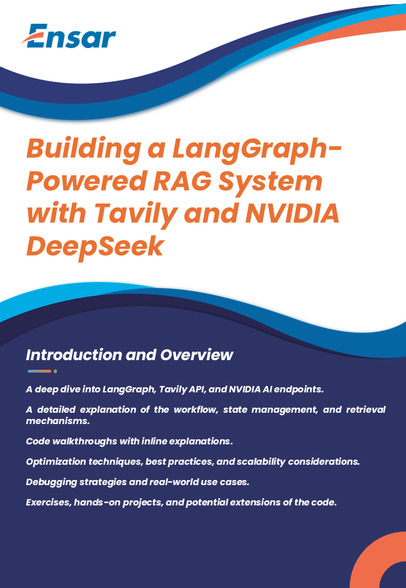

Guide for advanced developers to learn and implement the provided code. This guide will cover:

- A deep dive into LangGraph, Tavily API, and NVIDIA AI endpoints.
- A detailed explanation of the workflow, state management, and retrieval mechanisms.
- Code walkthroughs with inline explanations.
- Optimization techniques, best practices, and scalability considerations.
- Debugging strategies and real-world use cases.
- Exercises, hands-on projects, and potential extensions of the code.

I will let you know when the guide is ready for review.

# **Advanced Developer Guide: Building a LangGraph-Powered RAG System with Tavily and NVIDIA DeepSeek**

## 1. Introduction and Overview

This guide provides a comprehensive, step-by-step walkthrough for advanced developers to implement a **retrieval-augmented generation (RAG)** pipeline using the provided Python code. The code leverages **LangGraph**, an advanced workflow framework built on LangChain, to orchestrate a dynamic question-answering agent. It integrates the **Tavily Search API** for information retrieval, uses **LangChain prompts** and LLMs for reasoning and validation, and employs **NVIDIA’s DeepSeek-R1** model via AI endpoints for generating final answers. We will delve into each component, explaining their roles and how they interconnect, and provide hands-on examples along the way.

**Use Case and Purpose:**  
The primary goal of the code (and this guide) is to build a robust **question-answering agent** that can handle complex queries by fetching relevant context from the web and using a powerful language model to produce accurate answers. Unlike a basic QA system, this agent can **iterate** and refine its approach: if the first attempt at retrieval doesn’t yield a good answer, it uses AI reasoning to decide on next steps (such as re-searching or terminating). This approach addresses a common challenge in RAG applications: when an initial search fails, the system can **loop back** and try again with improved strategies ([LangGraph](https://blog.langchain.dev/langgraph/#:~:text=An%20example%20of%20why%20this,flexible%20and%20thus%20can%20accomplish)). The result is a more resilient AI assistant capable of handling ambiguous or open-ended questions.

**Key Components:**  
Let’s briefly introduce the major components of this system and their roles:

- **LangGraph:** An extension of LangChain for designing **stateful workflows** as graphs (state machines). It allows us to define an agent’s behavior in terms of nodes (tasks) and edges (transitions), including loops and conditional branches. LangGraph is built to create **resilient, cyclical agent flows** rather than simple linear chains ([LangGraph](https://blog.langchain.dev/langgraph/#:~:text=One%20of%20the%20things%20we,useful%20when%20creating%20agent%20runtimes)) ([LangGraph](https://blog.langchain.dev/langgraph/#:~:text=These%20types%20of%20applications%20are,that%20essentially%20has%20two%20steps)). In this project, LangGraph’s `StateGraph` is used to maintain the agent’s state (like the question, retrieved context, decisions, etc.) across multiple steps. We’ll use it to build a flexible workflow that decides whether to continue searching or proceed to answering.

- **Tavily API (Retrieval):** Tavily is a search engine tailored for LLMs that provides **real-time, accurate web search results** for use in AI applications ([Tavily](https://tavily.com/#:~:text=Empowering%20your%20AI%20applications%20with,tailored%20for%20LLMs%20and%20RAG)). Through Tavily’s API, our agent can fetch relevant documents or snippets from the web given a user query. Essentially, Tavily serves as the _retriever_ in our RAG pipeline, supplying the context that the LLM will use to answer the question. We will cover how to integrate Tavily via its Python SDK or LangChain’s retriever interface, how to parse the results into a useful format, and how to handle limitations like rate limits or zero-result cases.

- **LangChain Prompts and LLM Chains (Validation):** LangChain provides a structured way to manage prompts and chain LLM calls. In our workflow, after retrieving information, we use an **LLM chain** to **validate** the retrieved context. This involves prompt engineering: we’ll craft a prompt that asks an LLM to analyze the search results relative to the question and decide if the information is sufficient or if further actions are needed. By instructing the LLM to output its decision in a structured JSON format, the code can easily parse the response to guide the next step. We’ll explore prompt template design, usage of LangChain’s `LLMChain` and output parsers, and techniques to get consistent, machine-readable answers from the model.

- **NVIDIA DeepSeek-R1 Model (Answering):** The final answering step uses **DeepSeek-R1**, a cutting-edge large language model released by NVIDIA. DeepSeek-R1 is a 671-billion-parameter MoE (Mixture-of-Experts) model known for its advanced reasoning, math, and coding capabilities ([DeepSeek-R1 Now Live With NVIDIA NIM | NVIDIA Blog](https://blogs.nvidia.com/blog/deepseek-r1-nim-microservice/#:~:text=DeepSeek,experts%20in%20parallel%20for%20evaluation)). It is made available via NVIDIA’s AI cloud endpoints (NIM microservice) or directly through DeepSeek’s API, using an OpenAI-compatible interface. In this guide, we’ll show how to set up access to this model (obtaining API keys and endpoints) and how to invoke it to generate a comprehensive answer given the user’s question and the retrieved context. The DeepSeek-R1 will serve as the “brain” that synthesizes all information and produces the final answer, especially beneficial for complex reasoning tasks ([DeepSeek-R1 Now Live With NVIDIA NIM | NVIDIA Blog](https://blogs.nvidia.com/blog/deepseek-r1-nim-microservice/#:~:text=DeepSeek,to%20generate%20the%20best%20answer)). We will also discuss processing the model’s response and handling scenarios where information is missing or the model is uncertain.

Throughout the guide, each section will contain **theory explanations** and **practical examples** (with code snippets) to solidify understanding. We encourage you to follow along with the code, and at the end of major sections, you’ll find suggested exercises or mini-projects to apply what you’ve learned. By the end of this guide, you should be comfortable with setting up a LangGraph workflow, integrating external APIs for retrieval and LLM inference, engineering prompts for decision-making, and extending the system for real-world applications.

**Prerequisites:**  
This guide assumes you have experience with Python and are familiar with basic LangChain concepts (chains, prompts, LLM usage). Knowledge of asynchronous programming and API usage in Python will be helpful when dealing with external services. Since this is aimed at advanced developers, we will dive into deeper topics like state management and dynamic control flow, but we will build up these concepts step by step. Let’s start by making sure our environment is ready.

_📌 **Key Takeaway:** The project implements a retrieval-augmented QA agent with a feedback loop. LangGraph manages the workflow (with loops and conditional logic), Tavily provides external knowledge from web search, LangChain’s prompting + an intermediate LLM ensures the agent only proceeds when it has good info, and NVIDIA’s DeepSeek-R1 model generates the final answer with strong reasoning. This combination yields a powerful, flexible QA system._

**Exercise – Thought Experiment:** Before proceeding, think about why each component is necessary. For example, why not just call the DeepSeek LLM directly with the question? Consider the balance between having relevant facts (via retrieval) and the reasoning power of a large model. Jot down what challenges might arise without a retrieval step or without the validation step. This will prime you for understanding the design decisions in the upcoming sections.

---

## 2. Setting Up the Environment

Before diving into coding, we need to prepare our development environment. This involves installing all required Python packages, setting up configuration files (like a `.env` for secrets), and ensuring we can access the necessary APIs (Tavily and NVIDIA’s). Proper setup is crucial for smooth experimentation and security.

### 2.1 Installing Dependencies

The project depends on several libraries, each serving a specific purpose. Below is a list of the main dependencies and their roles:

- **LangChain** – Provides the foundational classes for LLMs, prompt templates, chains, and integrations (including the Tavily retriever). We’ll use it for prompt management and possibly calling the DeepSeek model if using an OpenAI-compatible interface.
- **LangGraph** – The extension library for constructing graph-based workflows (state machines) on top of LangChai ([GitHub - langchain-ai/langgraph: Build resilient language agents as graphs.](https://github.com/langchain-ai/langgraph#:~:text=LangGraph%20is%20a%20library%20for,out%20an%20introductory%20tutorial%20here))】. This needs to be installed separately (as it’s a newer module).
- **Tavily Python SDK** – Allows direct calls to Tavily’s search API. Alternatively, the `langchain-community` package includes a Tavily retriever wrapper.
- **Python Dotenv** – (Optional but recommended) for loading environment variables from a `.env` file. This helps manage API keys securely.
- **Requests** – For making HTTP calls to external APIs. We will likely use `requests` to call the DeepSeek API unless using a specialized SDK.
- **Any LLM providers SDK** – Depending on the LLM used for validation or any OpenAI-compatible call, you might need OpenAI’s SDK or similar. (For instance, if using OpenAI for the validation step or if DeepSeek is accessed via an OpenAI-compatible endpoint, the `openai` Python library could be used. In this guide, we’ll demonstrate using raw HTTP requests for clarity.)

**Installation:**  
You can install these packages via pip. For reproducibility, consider using a virtual environment (venv or conda environment). Below is a sample installation command:

```bash
pip install langchain langgraph tavily-python langchain-community python-dotenv requests
```

Let’s break down the above:

- `langchain`: main LangChain library.
- `langgraph`: LangGraph library (the GitHub suggests this is the name; as of LangChain v0.1+ it might also be included, but explicit install ensures you have it ([GitHub - langchain-ai/langgraph: Build resilient language agents as graphs.](https://github.com/langchain-ai/langgraph#:~:text=pip%20install%20))】.
- `tavily-python`: Tavily API wrapper (for direct use).
- `langchain-community`: Contains community integrations, including TavilySearchAPIRetriever (if you plan to use LangChain’s retriever interface for Tavily ([TavilySearchAPIRetriever | ️ LangChain](https://python.langchain.com/docs/integrations/retrievers/tavily/#:~:text=The%20integration%20lives%20in%20the,python%60%20package%20itself))】.
- `python-dotenv`: to load environment variables from a file.
- `requests`: for HTTP calls (if needed for DeepSeek or any custom integration).

After installation, verify that you can import these in a Python REPL without errors:

```python
import langchain
import langgraph
import tavily
import requests
```

If any import fails, double-check that the library is installed or consult the library’s documentation for installation issues.

### 2.2 Configuring Environment Variables (.env)

Handling API keys and secret tokens securely is paramount. We will use environment variables to store sensitive information like API keys. This prevents hardcoding secrets in your code, which could be accidentally exposed. In development, a common approach is to use a **`.env` file** and `dotenv` to load it.

**Setting Up the `.env` File:**  
Create a file named `.env` in your project directory. Inside, you’ll specify the keys provided by Tavily and NVIDIA (or DeepSeek). For example:

```dotenv
TAVILY_API_KEY=your_tavily_api_key_here
DEEPSEEK_API_KEY=your_deepseek_api_key_here
# (Optional) If using OpenAI or another LLM for validation:
OPENAI_API_KEY=your_openai_key_here
```

Make sure to replace the placeholder values with your actual keys:

- **TAVILY_API_KEY:** You can obtain this by signing up on Tavily’s website and generating an API key from your accoun ([TavilySearchAPIRetriever | ️ LangChain](https://python.langchain.com/docs/integrations/retrievers/tavily/#:~:text=We%20also%20need%20to%20set,our%20Tavily%20API%20key))】.
- **DEEPSEEK_API_KEY:** This will come either from NVIDIA’s NGC/Build portal or from DeepSeek’s site. We’ll discuss how to get this in Section 7. For now, assume you have a key (it might be a token similar to OpenAI keys).
- If you plan to use OpenAI’s model for the validation step (not required, but some might), include `OPENAI_API_KEY` or any other provider keys as needed.

**Loading Environment Variables in Code:**  
In your Python script or Jupyter notebook, load the environment variables at the start:

```python
from dotenv import load_dotenv
import os

load_dotenv()  # take environment variables from .env.

TAVILY_API_KEY = os.getenv("TAVILY_API_KEY")
DEEPSEEK_API_KEY = os.getenv("DEEPSEEK_API_KEY")
```

By doing this, you can now use `TAVILY_API_KEY` and `DEEPSEEK_API_KEY` in your code to authenticate API calls without exposing the actual values in code. **Never** commit your `.env` file to version control (add it to `.gitignore` if using git).

**API Key Management Best Practices:**

- **Least Privilege:** Only enable permissions your application needs. (For instance, if Tavily allows scoping the key to certain endpoints or quotas, use that feature.)
- **Rotation:** Regularly rotate your API keys if possible, and have a strategy for replacing keys without downtime.
- **Secure Storage:** In production, use a secrets manager or environment variable configuration provided by your deployment platform (e.g., AWS Secrets Manager, Docker secrets, etc.) rather than a plaintext .env file.
- **Monitoring:** Keep an eye on your API usage. Tavily’s free tier is up to 1,000 call ([LLM Enhanced Web Search: The Tavily & Lang Chain - Kaggle](https://www.kaggle.com/code/marcinrutecki/llm-enhanced-web-search-the-tavily-lang-chain/notebook#:~:text=LLM%20Enhanced%20Web%20Search%3A%20The,com%2Fdocs%2Ffaq))】, and DeepSeek may have rate limits or costs per token. If you hit limits, you may get errors or slowed responses – handle these gracefully (we’ll cover error handling in a later section).

**Verify Access:**  
As a quick test after setting up, try a simple API call with each service to ensure your keys work:

- For Tavily: you could use the Tavily SDK or a simple HTTP GET (depending on their API spec) to perform a test search (e.g., search for “hello world”) and see if you get a response. We’ll cover the exact usage in the retrieval section, so a full test can be done there.
- For DeepSeek: if you have an endpoint URL, try a trivial prompt to the model (like “Hello”) and see if you get a response. (Again, details in Section 7.)

**Troubleshooting Setup:**

- If you get import errors, check if there are version conflicts. Sometimes `langchain` might install a different version of `typing_extensions` that could conflict with `TypedDict` usage. Upgrading or using a fresh environment can help.
- If environment variables are not loading, ensure `python-dotenv` is installed and that you called `load_dotenv()` before trying to get the variables.
- If API calls fail with authentication errors, double-check that the keys are correct (no extra spaces, etc.) and that the environment variables are being read properly (print them carefully to debug, but avoid printing in logs in real apps).

**Exercise – Environment Dry Run:**

1. Write a short Python script that loads the environment and prints a message confirming that it retrieved the API keys (without printing the keys themselves). For example:
   ```python
   import os; from dotenv import load_dotenv; load_dotenv()
   print("Tavily Key present:", os.getenv("TAVILY_API_KEY") is not None)
   print("DeepSeek Key present:", os.getenv("DEEPSEEK_API_KEY") is not None)
   ```
   Run this script to ensure it prints `True` for both keys.
2. Use the `requests` library to make a simple GET request to Tavily’s API endpoint (check Tavily docs for an example endpoint, or use LangChain’s retriever in a quick test) to verify that your key is valid and the API responds. Similarly, test a simple call to the DeepSeek endpoint (we will detail the endpoints later, but if you have them now, testing connectivity is useful).

---

## 3. Understanding LangGraph and StateGraph

With the environment ready, we can focus on the core framework of our application: **LangGraph**. LangGraph introduces the concept of representing an LLM-driven workflow as a graph with a **state**. This is fundamental to enabling loops and conditional logic in our agent. In this section, we’ll explain how state management works in LangGraph, what a `StateGraph` is, and how to define a state schema using `TypedDict`. We’ll also outline how to construct workflows with nodes that update this state.

### 3.1 What is LangGraph? (Recap)

LangGraph is essentially a library to build **stateful, multi-step AI agents** as graph ([GitHub - langchain-ai/langgraph: Build resilient language agents as graphs.](https://github.com/langchain-ai/langgraph#:~:text=LangGraph%20is%20a%20library%20for,out%20an%20introductory%20tutorial%20here))】. Think of it as a way to draw a flowchart for your LLM application, where each node is a step (an action or decision) and edges define how to move from one step to the next (including possibly looping back). This is different from a normal LangChain **Chain**, which is typically linear or a directed acyclic graph. LangGraph allows **cycles**, meaning the output of an LLM can determine that we need to repeat a step or choose a different path, which is extremely useful for our use-case of iterative retrieval.

In our QA agent scenario, we will have nodes for actions like “perform web search”, “validate results”, and “generate answer”. LangGraph will let us connect these with conditional edges (e.g., if results are insufficient, go back to search; if sufficient, proceed to answer). This forms a **state machine** for the agen ([LangGraph](https://blog.langchain.dev/langgraph/#:~:text=When%20talking%20about%20these%20more,our%20blog%20on%20cognitive%20architectures))】. Each iteration of the loop can update some memory (state), like accumulating what searches have been tried or storing the retrieved info.

### 3.2 StateGraph and State Management

**StateGraph** is the central class in LangGraph that holds the **state** and the graph structure. When you initialize a `StateGraph`, you provide a definition of the state it will carry throughout the workflo ([LangGraph](https://blog.langchain.dev/langgraph/#:~:text=StateGraph))】. The state is essentially a Python dictionary that all nodes can read from and write to. Defining a clear schema for this state is important so that each part of the code knows what keys to expect.

LangGraph uses Python’s `TypedDict` to define the state structure. A `TypedDict` is a way to specify the expected keys and value types for a dictionary (basically adding type hints to a dict). Here’s how you might define a state for our application:

```python
from typing import TypedDict, List, Annotated
import operator

class QAState(TypedDict):
    query: str
    retrieved_docs: Annotated[List[str], operator.add]  # list of retrieved texts
    validation_decision: str  # e.g. "ENOUGH_INFO" or "NEED_MORE_INFO"
    final_answer: str
```

In this example:

- `query`: The user’s question (input).
- `retrieved_docs`: A list of retrieved text snippets or documents from Tavily. We use `Annotated[List[str], operator.add]` here to tell LangGraph that when a node returns an update for this key, it should **append** to the list rather than replace i ([LangGraph](https://blog.langchain.dev/langgraph/#:~:text=class%20State,str%5D%2C%20operator.add))】. This is useful if we want to accumulate results over multiple retrieval rounds. If we prefer to only keep the latest retrieval results (overwriting previous ones), we can omit the annotated operator or use a different approach (like storing only the latest in another field).
- `validation_decision`: A string to store the decision made by the validation LLM (e.g., it could be "sufficient" vs "insufficient", or a more complex decision structure – we’ll decide on the exact format when we implement the validation step).
- `final_answer`: The answer produced by the DeepSeek LLM. This will be filled at the end of the workflow.

**Initializing the StateGraph:**  
Once we have our `QAState` definition, we create a `StateGraph` instance:

```python
from langgraph.graph import StateGraph

# Initialize the graph with the state schema
graph = StateGraph(QAState)
```

This sets up an empty graph that knows about our state format. The `StateGraph` internally will maintain an instance of `QAState` (or a dict matching that schema) as the agent’s memory. By default, each key might need an initial value when we start an execution. We can provide an initial state when running the graph (or possibly when initializing, depending on LangGraph’s API version). For example, initial state might include `query=<user question>`, and empty structures for others:

```python
initial_state = QAState(
    query=user_question,
    retrieved_docs=[],
    validation_decision="",
    final_answer=""
)
```

### 3.3 Nodes in LangGraph

**Nodes** represent the actions or computations in the graph. Each node is typically a function (or a LangChain “runnable”) that takes the current state as input (as a dict) and returns a dict of **updates** to the stat ([LangGraph](https://blog.langchain.dev/langgraph/#:~:text=After%20creating%20a%20,object%20to%20update))】. LangGraph will take these updates and merge them into the global state (either overriding or appending based on our `Annotated` specification).

We add a node to the graph with `graph.add_node(name, value)`, where `name` is a unique identifier for that node, and `value` is the function (or chain) that should be executed at that ste ([LangGraph](https://blog.langchain.dev/langgraph/#:~:text=Nodes))】.

In our QA system, we will likely have at least three main nodes:

1. **Retrieval Node** – calls Tavily API with the query and maybe some modified query, returns retrieved documents (updates `retrieved_docs` in the state).
2. **Validation Node** – calls an LLM (via LangChain) to analyze the `query` and `retrieved_docs`, then returns a decision (updates `validation_decision`).
3. **Answer Node** – calls DeepSeek-R1 with the `query` and `retrieved_docs` to get the final answer (updates `final_answer`).

We might also have additional helper nodes or logic, such as:

- A node to refine the query (if we decide to implement query refinement based on previous results).
- A terminator or end node, although LangGraph provides a special `END` node constant for ending the graph.

Let’s add placeholder nodes to our graph (we’ll flesh them out in later sections):

```python
# Define dummy functions for illustration
def retrieve_step(state: QAState) -> dict:
    query = state["query"]
    # Imagine we call Tavily and get docs (we'll implement this later)
    docs = []  # placeholder for retrieved docs
    return {"retrieved_docs": docs}

def validate_step(state: QAState) -> dict:
    docs = state["retrieved_docs"]
    query = state["query"]
    # Imagine we call an LLM to validate (to be implemented)
    decision = "ENOUGH_INFO"  # or "NEED_MORE_INFO"
    return {"validation_decision": decision}

def answer_step(state: QAState) -> dict:
    query = state["query"]
    docs = state["retrieved_docs"]
    # Imagine we call DeepSeek to get answer (to be implemented)
    answer = "Placeholder answer"
    return {"final_answer": answer}

# Add nodes to the graph
graph.add_node("retrieval", retrieve_step)
graph.add_node("validation", validate_step)
graph.add_node("answer", answer_step)
```

Each of these functions accepts the state dict and returns updates. Notice we return a normal Python dict with keys matching some or all of the state keys:

- `retrieve_step` will set `retrieved_docs`.
- `validate_step` sets `validation_decision`.
- `answer_step` sets `final_answer`.

LangGraph will merge these into the global state each time the node is executed. Because `retrieved_docs` is a list with the `operator.add` annotation, if `retrieve_step` returns `{"retrieved_docs": new_list}`, LangGraph will actually append that `new_list` to the existing `retrieved_docs` list in state (not replace it ([LangGraph](https://blog.langchain.dev/langgraph/#:~:text=class%20State,str%5D%2C%20operator.add))】. We need to ensure the value returned is a list itself (even a list of one item) to append properly. Alternatively, if we want to replace instead of append, we could structure it differently or not use the `operator.add` annotation.

LangGraph provides a special node name `END` to mark the end of the grap ([LangGraph](https://blog.langchain.dev/langgraph/#:~:text=There%20is%20also%20a%20special,be%20able%20to%20end%20eventually))】. We don’t explicitly add an END node via `add_node`; instead, we use it when adding edges to indicate termination.

### 3.4 Stateful Workflows with TypedDict

Using a typed state has several advantages:

- **Clarity:** We know exactly what data flows through the system (like a contract for our nodes). This makes the code easier to understand and less error-prone.
- **Validation:** If a node tries to return a key that isn’t in the `QAState`, LangGraph can warn or error out, catching mistakes such as typos in key names.
- **State Persistence:** Because we have a central state, it’s easy to log or inspect the entire state at any point for debugging. LangGraph even supports persisting state between runs (e.g., to checkpoint progress or allow a human to intervene and then resume ([GitHub - langchain-ai/langgraph: Build resilient language agents as graphs.](https://github.com/langchain-ai/langgraph#:~:text=,key%20stages%20via%20human%20input))】, but that’s an advanced feature beyond this guide’s scope. Just be aware that having all relevant info in the state makes such extensions possible.

When designing your own state:

- Include all pieces of data that need to be shared between nodes or preserved across steps.
- Avoid putting extremely large data in state if not necessary (for example, if Tavily returns huge documents, maybe store just essential excerpts or references, unless the LLM needs the full text).
- You can nest structures (e.g., a dict of metadata) or use complex types. Just ensure to define them in the TypedDict for consistency.

**Example:** If we wanted to store not just the text of retrieved docs but also their titles or URLs, we could define:

```python
class QAState(TypedDict):
    query: str
    retrieved_docs: Annotated[List[dict], operator.add]  # list of docs, where each doc is dict with 'title' and 'content'
    validation_decision: str
    final_answer: str
```

And have `retrieve_step` return something like:

```python
return {"retrieved_docs": [{"title": title1, "content": snippet1}, {"title": title2, "content": snippet2}]}
```

This would accumulate a list of result dicts.

We will see a concrete implementation of the retrieval node in the next section, and similarly flesh out the validation and answer nodes later.

**Exercise – Define Your State:**  
Consider another scenario (other than QA) where you might use an LLM with retrieval. For example, a code assistant that searches documentation and then answers, or a chatbot that uses multiple tools (calculator, search, etc.). Draft a TypedDict for the state of that system. List what keys you’d have and whether each should be cumulative or replaceable. This practice will help reinforce how to model state for complex LLM applications.

---

## 4. Retrieval Mechanism with Tavily API

One of the first steps in our workflow is retrieval: getting relevant context for the user’s question. We’re using the **Tavily Search API** for this purpose. In this section, we’ll cover how the retrieval function is implemented, how to parse and structure the returned data, and how to deal with practical issues like API usage limits.

### 4.1 Using Tavily’s API for Web Search

Tavily provides an API that is specifically designed for LLM usage. This means it can return results quickly and in a format that’s easy to feed into an LLM (often direct text snippets). According to Tavily’s documentation, it offers real-time and factual results geared towards retrieval-augmented generation use case ([Tavily](https://tavily.com/#:~:text=Empowering%20your%20AI%20applications%20with,tailored%20for%20LLMs%20and%20RAG))】.

We have two main ways to call Tavily in Python:

- Using the **Tavily Python SDK** (`tavily-python` package).
- Using **LangChain’s TavilySearchAPIRetriever** which is a wrapper in the `langchain_community` module.

**Option A: Tavily Python SDK**  
The Tavily SDK likely provides a client where you can input a query and get back search results. (For example, many search APIs return a JSON with titles, snippets, and URLs.) We’d need to refer to Tavily’s docs for the exact usage. A hypothetical usage with SDK might look like:

```python
from tavily import TavilyClient

client = TavilyClient(api_key=TAVILY_API_KEY)
results = client.search("What is the capital of France?", k=3)  # assume k results
```

This could return a Python object or dict containing the results.

**Option B: LangChain’s Retriever**  
LangChain’s integration (as of their community modules) provides `TavilySearchAPIRetriever`. This retriever can be used similarly to other retrievers in LangChain. For instance:

```python
from langchain_community.retrievers import TavilySearchAPIRetriever

retriever = TavilySearchAPIRetriever(api_key=TAVILY_API_KEY, k=3)
docs = retriever.get_relevant_documents("What is the capital of France?")
```

Here, `docs` would be a list of LangChain `Document` objects containing the content and metadata for the top search result ([TavilySearchAPIRetriever | ️ LangChain](https://python.langchain.com/docs/integrations/retrievers/tavily/#:~:text=Now%20we%20can%20instantiate%20our,retriever)) ([TavilySearchAPIRetriever | ️ LangChain](https://python.langchain.com/docs/integrations/retrievers/tavily/#:~:text=%5BDocument%28metadata%3D,player%20being%20able%20to))】. Each `Document` typically has attributes like `page_content` (the text snippet) and `metadata` (which may include the source URL, title, etc.). The example in LangChain docs shows the content and metadata (title, source URL, score, etc.) for each resul ([TavilySearchAPIRetriever | ️ LangChain](https://python.langchain.com/docs/integrations/retrievers/tavily/#:~:text=%5BDocument%28metadata%3D,player%20being%20able%20to))】.

For our guide, we will proceed using the LangChain retriever (Option B), because it integrates smoothly and gives us already parsed text. However, the principles will be similar if using the SDK directly. You can adapt the approach as needed.

### 4.2 Implementing the Retrieval Node

Now, let’s implement our `retrieve_step` function properly using Tavily. We will retrieve relevant documents for the query and update the state accordingly.

**Step-by-step inside `retrieve_step`:**

1. Read the `query` from the state.
2. Use Tavily API (via retriever or direct) to search for that query.
3. Obtain the top _k_ results (k could be 3-5, depending on how many context snippets you want).
4. Extract the relevant text from results. We might take just the `page_content` from each Document if using LangChain, or the snippet field if using raw API.
5. Return a dict that updates `retrieved_docs` in the state.

**Code Example:**

```python
from langchain_community.retrievers import TavilySearchAPIRetriever

# Initialize Tavily retriever once (perhaps outside the function, and reuse it)
tavily_retriever = TavilySearchAPIRetriever(api_key=TAVILY_API_KEY, k=3)

def retrieve_step(state: QAState) -> dict:
    query = state["query"]
    try:
        # Use Tavily to get relevant documents
        documents = tavily_retriever.get_relevant_documents(query)
    except Exception as e:
        # Handle errors (could be API errors, etc.)
        print(f"Retrieval error: {e}")
        return {"retrieved_docs": []}
    # Extract text from documents
    retrieved_texts = []
    for doc in documents:
        text = doc.page_content
        # Optionally, we could include doc.metadata like title or url for reference
        retrieved_texts.append(text)
    return {"retrieved_docs": retrieved_texts}
```

In this snippet:

- We create a `TavilySearchAPIRetriever` with `k=3` (meaning it will fetch 3 results). Ensure you’ve set the API key either via environment or passing directly as shown.
- We catch exceptions around the retrieval in case the API call fails (network issues or if the key is invalid, etc.). On failure, we return an empty list to `retrieved_docs` to signal no info was gathered (the validation step can detect that and possibly decide to end or try differently).
- We iterate over the returned documents and collect their text content. We choose to only take the main content because that’s what the LLM will use. If you anticipate needing the source or title (for citations or debugging), you could store tuples or dicts as mentioned earlier (title + content).
- We then return the updates as `{"retrieved_docs": retrieved_texts}`. Thanks to the `operator.add` annotation on `retrieved_docs`, if this function is called multiple times, new results will be appended to the list already in stat ([LangGraph](https://blog.langchain.dev/langgraph/#:~:text=class%20State,str%5D%2C%20operator.add))】. This means we might accumulate results from multiple searches. We’ll need to handle that logic carefully in validation (for example, we might clear previous results if we decide to start fresh, or always consider all collected info).

**Handling No Results:**  
It’s possible Tavily returns an empty list (if the query is very obscure or there’s an error). Our function above would return an empty list in that case. The validation step should check if `retrieved_docs` is empty and treat it as “no info found”. In some cases, it might be wise to have a fallback – for example, if Tavily fails, maybe try a different search service (this is an extension idea for later).

**Rate Limiting and Usage Considerations:**  
Tavily’s free tier allows a certain number of calls (e.g., 1000 ([LLM Enhanced Web Search: The Tavily & Lang Chain - Kaggle](https://www.kaggle.com/code/marcinrutecki/llm-enhanced-web-search-the-tavily-lang-chain/notebook#:~:text=LLM%20Enhanced%20Web%20Search%3A%20The,com%2Fdocs%2Ffaq))】. If your agent might loop retrieval several times or if you expect heavy usage, consider:

- **Caching**: If the same query is asked multiple times, cache the results so you don’t call the API repeatedly for identical queries.
- **Rate limit handling**: Tavily might return a specific error or status code (429 Too Many Requests) when rate-limited. You should catch such responses and either backoff (sleep and retry after a delay) or fail gracefully. For example, if `e` in the exception catching indicates rate limit, you could pause or reduce functionality.
- **Adjusting `k`**: More results means more tokens to process in the LLM. You might tune `k` based on how much context the final LLM can handle. DeepSeek-R1 can handle a very large context (up to 128k tokens ([DeepSeek-R1 Now Live With NVIDIA NIM | NVIDIA Blog](https://blogs.nvidia.com/blog/deepseek-r1-nim-microservice/#:~:text=DeepSeek,experts%20in%20parallel%20for%20evaluation))】, but using that full capacity can be costly. A typical approach is to fetch a moderate number of results (3-5) and perhaps truncate each to a few paragraphs if they’re long, to keep the context relevant and concise.

**Parsing and Structuring the Context:**  
The output of our retrieve node is a list of text snippets. For the next steps, we might combine them or present them to the LLM. Some strategies:

- **Concatenation**: Join the snippets with some separator (like “\n\n”) and feed as one block of context.
- **Summarization**: If the retrieved texts are too long, you could summarize each one (using another LLM call) before validation or final answer. This is an advanced optimization to reduce token load.
- **Relevance filtering**: Perhaps your validation step can also judge which retrieved piece is most relevant, especially if you fetched many. We won’t go deep into that here, but it’s something to note for scaling up.

For now, we will keep it simple: assume the top-k results are relevant enough and use them all.

### 4.3 Testing the Retrieval Function

Before integrating into the graph, it’s a good practice to test `retrieve_step` in isolation:

```python
# Suppose we set up a test state
test_state = QAState(query="What is the capital of France?", retrieved_docs=[], validation_decision="", final_answer="")
result = retrieve_step(test_state)
print("Retrieved docs:", result["retrieved_docs"])
print("Number of docs:", len(result["retrieved_docs"]))
```

You should see a list of strings (each string likely containing a snippet about France’s capital, Paris). If `len(result["retrieved_docs"])` is 3 (for k=3) and the content looks reasonable, it’s working. If it’s 0 or an error, debug accordingly:

- Check API key validity.
- Try a simpler query or ensure internet connectivity.
- Print any exception message for clues (the code above prints on exception).

### 4.4 Integrating into LangGraph

Now we integrate this node into our graph. If you added it with `graph.add_node("retrieval", retrieve_step)` earlier, ensure that’s done. Also, we need to set which node starts first in the StateGraph:

```python
graph.set_entry_point("retrieval")
```

This tells LangGraph that when we execute the graph, it should begin at the retrieval nod ([LangGraph](https://blog.langchain.dev/langgraph/#:~:text=The%20Starting%20Edge))】. Typically, the entry point uses the `query` (already in state) to perform search first.

We will add edges (transitions) after we define the other nodes, but it’s clear that after retrieval, we intend to go to validation. So likely we’ll add an edge from `"retrieval"` to `"validation"` (either unconditional or maybe conditional if you wanted to skip validation when no results—though the validation function itself can handle that logic).

**Memory Consideration:**  
Given we might loop back to `"retrieval"` from validation (if not enough info), we should consider whether to clear or append to `retrieved_docs`. We set it to append mode. This means if the agent searches again, the new results will be added to the list. That could lead to a growing context (which might be fine up to some limit). Alternatively, we might decide to clear previous results when doing a second search to avoid confusion, depending on strategy:

- One strategy: each time, only consider the latest search results. In that case, it might be better to not accumulate. We could have the validation node or the logic that triggers a second search clear the list (e.g., set `state["retrieved_docs"] = []` before calling retrieve again). Or define `retrieved_docs` without operator.add (so that returning a new list will overwrite).
- Another strategy: keep all results found so far. Maybe the second search finds something that complements the first. In that case, accumulation is useful.

We’ll stick with accumulation for now but keep this design choice in mind.

### 4.5 Handling API Limitations

**Rate Limits**: If you run a stress test or a loop with many iterations, monitor how Tavily responds. The free tier might slow down or error if too many calls. For a production scenario, you might need to upgrade your plan or integrate a pause between calls if you detect a 429 status. LangChain’s retriever might not automatically handle backoff, so manual handling is on you as the developer.

**Quality of Results**: Not a “limitation” per se, but sometimes search results might not directly answer the question (especially if the query is vague). This is exactly why we have a validation and possibly a loop. But you might also improve the query before sending to Tavily:

- For instance, if the user query is conversational or too broad, an LLM could reformulate it into a better search query (e.g., strip out polite fluff or add context). Tavily might also have advanced search parameters (like site filtering, date filters, etc.). An advanced implementation might add a step to preprocess the query for optimal search. We won’t dive deep here, but keep in mind.

**API Changes**: Always check Tavily’s latest docs for any changes in endpoint or response format. The LangChain integration abstracts that away, but if using the SDK, ensure you use the correct function calls. If Tavily’s API is updated (like new features such as direct Q&A mode), consider using them to improve your pipeline.

**Exercise – Custom Retrieval Experiment:**  
Try swapping out Tavily for another data source to see how pluggable the retrieval step is. For example, use a local text file or a Wikipedia API for retrieval:

- Write a quick function that reads from a local list of documents (or calls Wikipedia API if internet) and use that instead of Tavily for `retrieve_step`.
- Adjust the rest of the workflow accordingly.
  This will show you how the retrieval mechanism can be abstracted. In real-world applications, you might combine multiple retrievers. With LangChain’s interface, you could even use a `MultiRetrievalQA` chain or have multiple retrieval nodes (one for web, one for internal knowledge base) and decide which to use – something to think about for extension.

---

## 5. Validation with LLM and Prompts

After retrieving candidate context, the next crucial step is to **validate** whether that context contains the information needed to answer the user’s question. This prevents the system from either answering with insufficient data (risking inaccuracies or hallucinations) or wasting time in a loop when it already has the answer. We’ll achieve this by employing an LLM to analyze the question and retrieved text and then output a structured decision. This section covers how to design the prompt for this validation, how to implement it using LangChain, and how to enforce a JSON output for easy parsing.

### 5.1 Purpose of the Validation Step

In a typical RAG flow, one might directly pass retrieved documents to the final LLM to get an answer. However, as noted earlier, the first retrieval might not always be successfu ([LangGraph](https://blog.langchain.dev/langgraph/#:~:text=retriever%20is%20made%20that%20returns,that%20may%20not%20be%20predefined))】. The validation step uses the reasoning capability of an LLM to introspect: _“Do we have enough info? If not, what should we do next?”_ This is a form of **prompt-based decision making**.

By doing this:

- We can avoid sending an empty or irrelevant context to the expensive DeepSeek model and getting a poor answer.
- We can decide to perform additional actions (like another retrieval) **dynamically**, not predetermined. This is where LangGraph’s conditional edges come into play (next section).
- We can even refine our strategy: the LLM might suggest _what is missing_, which could guide a refined search query (advanced use).

### 5.2 Crafting the Validation Prompt

The prompt given to the validation LLM is critical. We need it to check the content thoroughly and then produce a **machine-readable** decision. Let’s outline what we want from this LLM:

- Input: the user’s question and the list of retrieved snippets.
- Task: determine if these snippets likely contain the answer to the question.
- Output: a decision, e.g., either “sufficient information” or “needs more information”. Optionally, if more info is needed, perhaps indicate what is missing or suggest next steps.

We also want the output in **JSON format** so our code can parse it easily (without having to do complex text processing or NLP on the LLM’s output). For example, the LLM could output:

```json
{
  "decision": "NEED_MORE_INFO",
  "reason": "The context does not mention the specific person asked in the question."
}
```

Or:

```json
{ "decision": "ENOUGH_INFO" }
```

We can design the prompt to make it output exactly this structure.

**Prompt Engineering Techniques:**  
Some best practices for this scenario:

- **Be explicit in instructions:** Clearly instruct the model to output ONLY the JSON and nothing else. We might say: “Respond only with a JSON object containing ... No additional commentary.”
- **Provide a schema or example:** You can show an example format in the prompt. E.g., “If enough info, respond with `{"decision": "ENOUGH_INFO"}`. If not, respond with `{"decision": "NEED_MORE_INFO", "reason": "..."}.”
- **Use system vs. user messages:** If using a chat model, a system message can set the role (“You are an expert analyzer ...”) and a user message can contain the question and context and ask for the decision.
- **Limit the scope:** Emphasize that the model should base its decision only on the provided context and not introduce unrelated info.

Let’s construct a simple version of the prompt. We’ll assume using a chat model through LangChain. We can use a `PromptTemplate` or just manually format a prompt string:

```python
from langchain import PromptTemplate

validation_prompt = PromptTemplate.from_template(
    "You are a helpful AI assistant tasked with validating whether provided context answers a question.\n"
    "Question: {question}\n"
    "Context:\n{context}\n\n"
    "Analyze the context and determine if it contains enough information to answer the question.\n"
    "If yes, output {{\"decision\": \"ENOUGH_INFO\"}}.\n"
    "If no, output {{\"decision\": \"NEED_MORE_INFO\", \"reason\": \"<brief reason>\"}}.\n"
    "Respond ONLY with a valid JSON object and nothing else."
)
```

In the above:

- We use placeholders `{question}` and `{context}` which LangChain will fill in with the actual data when we run the prompt.
- We explicitly show the JSON formats in the instruction (using double braces `{{` in the string to escape into a single brace in the final prompt template string).
- We explicitly say "Respond ONLY with a valid JSON object".

Alternatively, LangChain provides **structured output parsers** which can enforce this format more robustly (using libraries like Pydantic or regex to parse). For simplicity and clarity, we’re doing it via prompt instructions. However, one could use `StructuredOutputParser` from LangChain to define a schema (with keys "decision" and "reason") and get a parser that both formats the prompt and parses the resul ([patterns-ai-core/langchainrb: Build LLM-powered applications in Ruby](https://github.com/patterns-ai-core/langchainrb#:~:text=Ruby%20github,JSON%20schema%3A%20json_schema%20%3D))】. This is a more advanced technique; as an advanced developer, you may explore it if needed. It essentially ensures the model adheres to the format by using well-crafted instructions and can retry if parsing fail ([Mastering Structured Output in LLMs: Choosing the Right Model for ...](https://medium.com/@docherty/mastering-structured-output-in-llms-choosing-the-right-model-for-json-output-with-langchain-be29fb6f6675#:~:text=Mastering%20Structured%20Output%20in%20LLMs%3A,format%2C%20often%20JSON%20or%20XML))】.

### 5.3 Choosing an LLM for Validation

Which LLM should we use to run this validation prompt? We have a few options:

- Use the same **DeepSeek-R1** model. However, DeepSeek is very large and potentially slower/costlier. Using it for a quick check might be overkill.
- Use a smaller hosted model (e.g., OpenAI GPT-4 or GPT-3.5 if available, or another API like Anthropic’s Claude) just for this classification task. These models are generally reliable at following format instructions and would add an external dependency.
- Use a local model if you have one that’s good at instruction following (for example, a smaller model fine-tuned for following prompts).
- Since the user’s code didn’t explicitly mention another API, they might have used either OpenAI’s API (commonly available) or possibly even DeepSeek with a short prompt. It’s okay to choose one approach for demonstration. We’ll illustrate using OpenAI’s GPT-3.5 as an example, because it’s widely known and can handle this well.

**Implementing the Validation Chain with LangChain:**  
We will create an `LLMChain` that takes our `validation_prompt` and an LLM (like OpenAI) to produce the output. For example:

```python
from langchain.llms import OpenAI  # or ChatOpenAI for chat models

# Initialize the LLM (ensure OPENAI_API_KEY is set in env or pass it)
llm = OpenAI(model_name="gpt-3.5-turbo", temperature=0)  # deterministic output with temp 0
validation_chain = LLMChain(llm=llm, prompt=validation_prompt)

def validate_step(state: QAState) -> dict:
    question = state["query"]
    docs = state["retrieved_docs"]
    # Join the context docs into one string (perhaps with separators)
    context_str = "\n\n".join(docs) if docs else "N/A"
    # Run the LLM chain
    result = validation_chain.run(question=question, context=context_str)
    # The result should be a JSON string (or just JSON if function calling was used)
    # Parse the result safely:
    decision = "NEED_MORE_INFO"
    reason = ""
    try:
        import json
        parsed = json.loads(result)
        decision = parsed.get("decision", "NEED_MORE_INFO")
        reason = parsed.get("reason", "")
    except Exception as e:
        print("Failed to parse validation LLM output, defaulting to NEED_MORE_INFO.", e)
        # If parse fails, assume we need more info as a safe route, or we could try to interpret the text.
        decision = "NEED_MORE_INFO"
        reason = "Parsing error"
    return {"validation_decision": decision}
```

Some things to note in this implementation:

- We used `temperature=0` for the OpenAI model to encourage it to stick exactly to the instructions (no randomness).
- We join the retrieved docs with a double newline as separator. If `docs` is empty, we put "N/A" or some placeholder, meaning no context was found – the LLM should then almost certainly say `NEED_MORE_INFO`.
- We run the chain with the given `question` and `context`. The `PromptTemplate` will create the full prompt text behind the scenes and feed it to the model.
- We attempt to parse the returned string with `json.loads`. If the model followed instructions, `result` might already be something like `'{"decision": "ENOUGH_INFO"}'` (a JSON-formatted string). We parse it into a Python dict.
- If parsing fails (which might happen if the model added extra commentary despite our instructions), we handle the exception by defaulting to `"NEED_MORE_INFO"`. We print a warning for debugging. Alternatively, one could attempt a regex to extract `{...}` from the text if needed, or use LangChain’s `OutputParser` which can do a retry automaticall ([patterns-ai-core/langchainrb: Build LLM-powered applications in Ruby](https://github.com/patterns-ai-core/langchainrb#:~:text=Ruby%20github,JSON%20schema%3A%20json_schema%20%3D))】.
- We return a dict updating `validation_decision` in the state. We chose to store only the decision string (like "ENOUGH_INFO" or "NEED_MORE_INFO"). We could store the reason as well if we want to use it for something (like refining the query). If so, we’d add a `validation_reason: str` in our `QAState` and include `reason` in the return.

**Testing the Validation Step:**  
We should test `validate_step` similarly:

```python
# Suppose after retrieval, our state has some docs:
test_state = QAState(
    query="What is the capital of France?",
    retrieved_docs=["Paris is the capital and most populous city of France."],
    validation_decision="", final_answer=""
)
result = validate_step(test_state)
print("Validation decision:", result["validation_decision"])
```

In this scenario, the context clearly answers the question, so ideally the LLM should output ENOUGH_INFO. If our implementation is correct, we’d see `"Validation decision: ENOUGH_INFO"`. If it says NEED_MORE_INFO erroneously, we may need to adjust the prompt or ensure the context is indeed recognized.

For example, if the prompt was too strict or the model didn’t see the answer, maybe adding a line like “If the question is answered in the context, definitely output ENOUGH_INFO” could reinforce it. This is iterative prompt tuning which you can refine as needed.

### 5.4 Ensuring JSON Structured Output

We already touched on the importance of structured output. A few additional techniques to ensure we get proper JSON:

- **Surround answer with markdown or delimiters**: Sometimes, instructing the model to put the JSON in a Markdown code block (like `json ... `) can help because the model then usually gives just that. But then you have to strip the backticks out. Not a big deal, but an extra step.
- **Function calling (OpenAI feature)**: If using GPT-4 or GPT-3.5 with function calling, one can define a function schema for the model (with fields decision and reason). The model will then return a JSON object natively. This would remove the need to parse via text. LangChain supports function calling in `ChatOpenAI`. This might be overkill for our purpose but is a very robust method for structured output. Advanced readers can consider it if using OpenAI’s models.
- **OutputParser in LangChain**: The `OutputFixingParser` can catch a non-JSON output and attempt to fix it by parsing and reformatting, possibly even calling another LLM to correct i ([Mastering Structured Output in LLMs: Choosing the Right Model for ...](https://medium.com/@docherty/mastering-structured-output-in-llms-choosing-the-right-model-for-json-output-with-langchain-be29fb6f6675#:~:text=Mastering%20Structured%20Output%20in%20LLMs%3A,format%2C%20often%20JSON%20or%20XML))】. Given our scenario, a simpler approach suffices, but do know such tools exist.

### 5.5 Using LLM Chains Effectively

We used `LLMChain` for simplicity. LangChain also has higher-level chains for QA, but since we want fine control and integration into LangGraph, individual chains are fine. A quick breakdown:

- **PromptTemplate**: We used `PromptTemplate.from_template` to create one from a string. We could also have built a `ChatPromptTemplate` explicitly, especially if we wanted multiple messages (system, user, etc. ([Prompt Templates | ️ LangChain](https://python.langchain.com/docs/concepts/prompt_templates/#:~:text=These%20prompt%20templates%20are%20used,a%20ChatPromptTemplate%20is%20as%20follows))】. For example:

  ```python
  from langchain.prompts import ChatPromptTemplate, SystemMessagePromptTemplate, HumanMessagePromptTemplate

  system_msg = SystemMessagePromptTemplate.from_template("You are a validation assistant...")
  human_msg = HumanMessagePromptTemplate.from_template("Question: {question}\nContext: {context}\n...")
  validation_prompt = ChatPromptTemplate.from_messages([system_msg, human_msg])
  ```

  Then use `ChatOpenAI` with `LLMChain`. Either approach works. The key is the content of the prompt, which we’ve covered.

- **Choosing Model**: We used GPT-3.5 in example. If you use another model, adjust `OpenAI(model_name="...")` or use `ChatOpenAI` accordingly. For instance, `ChatOpenAI(model_name="gpt-4", temperature=0)` or `Anthropic` etc. Ensure to handle API keys (OpenAI key from env or Anthropic key, etc.).

- **Temperature and Determinism**: Setting temperature to 0 (or very low) is important for reliability here. We don’t want the model being creative; we want a consistent classification. This reduces random variations where the model might sometimes output some explanatory text or synonyms that break JSON parsing.

### 5.6 Integrating Validation Node

Now, ensure `validate_step` is added to LangGraph:

```python
graph.add_node("validation", validate_step)
```

We likely want the retrieval node to always go to validation next. We can add a normal edge for that:

```python
graph.add_edge("retrieval", "validation")
```

This means after `retrieval` node executes, it will proceed to `validation` node directl ([LangGraph](https://blog.langchain.dev/langgraph/#:~:text=Normal%20Edges))】.

The interesting part will be what happens after validation, which depends on `validation_decision`. That we will handle in the next section (Decision Routing).

### 5.7 Example and Testing

Let’s simulate what we have so far (without decision routing, just manually):

```python
# Simulate running retrieval then validation sequentially
state = QAState(query="Who is the CEO of Tesla?", retrieved_docs=[], validation_decision="", final_answer="")
state.update(retrieve_step(state))    # run retrieval
state.update(validate_step(state))    # run validation
print("Retrieved Docs:", state["retrieved_docs"])
print("Validation Decision:", state["validation_decision"])
```

This should print out some docs related to Tesla’s CEO (likely containing “Elon Musk” if that’s still current) and the decision. If the info was found, decision might be ENOUGH_INFO. If not (or if our validation logic is conservative because maybe the snippet didn’t explicitly say he’s CEO, just that Elon Musk is the founder, etc.), it might say NEED_MORE_INFO. That’s good: in that case the agent should perhaps try another search or proceed differently.

This manual test ensures that each piece works in isolation. Once confirmed, we’ll rely on LangGraph to orchestrate the actual flow including looping.

**Exercise – Prompt Tuning:**  
Try altering the validation prompt to see how the output changes. For example, remove the “Respond ONLY with JSON” line and see if the model then includes explanation outside JSON. Then try to parse it and observe the failure. This will teach you how slight changes in phrasing can affect the reliability of structured outputs. Restore the prompt instruction and verify it behaves correctly again. This kind of experimentation is common in prompt engineering to get the desired format.

---

## 6. Decision Routing and Workflow Construction

This section brings together the retrieval and validation steps with LangGraph’s capabilities to enable dynamic decision-making. We will construct the full workflow (graph) by adding edges between nodes, including conditional edges that use the validation output to decide the next step. We’ll also discuss how to optimize the routing logic (like avoiding infinite loops and making smart decisions).

### 6.1 Designing the Workflow Logic

Our agent’s high-level logic is:

1. Retrieve context for the query.
2. Validate if the context is sufficient.
3. If sufficient, proceed to generate the answer.
4. If not sufficient, perhaps perform a second retrieval (maybe with a refined query or additional search terms), then validate again.
5. Repeat if necessary, or give up after a certain number of tries.
6. Finally, provide the answer (or a message that it cannot be found, if applicable).

In LangGraph terms, this translates to a graph with possible loops:

- Node “retrieval” -> Node “validation” -> (if NEED_MORE_INFO) -> Node “retrieval” (loop back for another search) or (if ENOUGH_INFO) -> Node “answer”.

This is a **conditional edge** scenario: after “validation”, we choose the next node based on the value of `validation_decision`. LangGraph supports conditional edges by specifying a function and a mapping for outcome ([LangGraph](https://blog.langchain.dev/langgraph/#:~:text=These%20are%20where%20a%20function,to%20pass%20in%20three%20things)) ([LangGraph](https://blog.langchain.dev/langgraph/#:~:text=graph.add_conditional_edge%28%20,%7D))】.

### 6.2 Adding Conditional Edges in LangGraph

We will implement a decision function that looks at the state after validation and returns a string indicating where to go next. Then we map that to the appropriate node.

**Decision function example:**

```python
from langgraph.graph import END

def decide_next(state: QAState) -> str:
    """Decide whether to continue with another retrieval or proceed to answer."""
    decision = state["validation_decision"]
    # If validation says we have enough info, go to answer, otherwise continue retrieval
    if decision == "ENOUGH_INFO":
        return "answer"
    else:
        # We could also implement a counter to limit retries here
        return "continue_search"
```

We might use the string `"continue_search"` to denote the path where we do another retrieval. However, in our graph, the retrieval node is named "retrieval". We can map “continue_search” to “retrieval” node. Alternatively, we return directly `"retrieval"` from the function. But using a mapping allows more descriptive decision outputs if needed.

Let’s go with directly returning node names for simplicity:

```python
def decide_next(state: QAState) -> str:
    return "answer" if state["validation_decision"] == "ENOUGH_INFO" else "retrieval"
```

But careful: If we loop back to “retrieval” without changing anything, we might just repeat the same search. Ideally, we should modify the query or note we’ve done one attempt. This introduces the concept of **optimizing the loop**, which we’ll cover soon. For now, assume maybe the second attempt could be a refined query. We could incorporate that into retrieval node or here.

For clarity, we might refine by adding a counter in state:

```python
class QAState(TypedDict):
    # ... previous fields ...
    attempts: Annotated[int, operator.add]
```

And increment it each time we do a retrieval. Then in `decide_next`, if attempts >= 2 (for example), we might decide to stop to avoid infinite loops. Or incorporate that logic in a separate condition.

To avoid complexity, let’s assume at most one loop (so two retrieval attempts total) for demonstration. We can later mention how to extend it.

**Adding the conditional edge:**

```python
graph.add_conditional_edge(
    "validation",           # after validation node
    decide_next,            # function to decide next node name
    {"answer": "answer", "retrieval": "retrieval"}  # mapping from possible outputs to node
)
```

However, mapping isn't needed if we ensure `decide_next` returns actual node keys. The mapping is more useful if outputs are different from node names. For completeness, LangGraph expects:

1. Upstream node name ("validation").
2. The deciding function (which will get state and return a key).
3. A mapping dict of that key to a node name, or to `END` to stop.

If `decide_next` returns a value not in the mapping, or one that equals the special `END`, the graph ends.

Alternatively, we could directly map the function’s outputs:

```python
graph.add_conditional_edge(
    "validation",
    lambda st: "continue" if st["validation_decision"] != "ENOUGH_INFO" else "end",
    { "continue": "retrieval", "end": END }
)
```

This approach might label the decisions as "continue" vs "end", mapping "continue" -> retrieval (loop) and "end" -> END node (which terminates, meaning we have what we need and presumably will produce an answer as final output). But in our case, we actually want to go to an "answer" node rather than immediately end when info is enough. The answer node will produce output and then presumably end.

So likely better mapping:

```python
graph.add_conditional_edge(
    "validation",
    lambda st: "enough" if st["validation_decision"] == "ENOUGH_INFO" else "need_more",
    { "enough": "answer", "need_more": "retrieval" }
)
```

This says: if enough info, go to answer node; if not, go back to retrieval node. We don’t use END here because after answer node, we will end the graph (since after answer we have no further edges, we can let that be the end or explicitly map answer -> END).

We should also define what happens after answer node. Typically, answer would be terminal – we have our final answer. We can either:

- Rely on the fact that if no edge is specified from "answer", the graph might implicitly end. But it’s safer to explicitly end. We can do:

```python
graph.add_edge("answer", END)
```

Or use `graph.set_termination("answer")` if such exists (LangChain example uses END constant).

We already imported `END` from langgraph.graph above. So do:

```python
graph.add_edge("answer", END)
```

Now our graph structure is:

- Entry: "retrieval"
- retrieval -> validation (normal edge)
- validation -> conditional edge to either retrieval or answer
- answer -> END

This forms a loop: retrieval -> validation -> (maybe back to retrieval) -> ... until validation goes to answer -> end.

### 6.3 Preventing Infinite Loops and Optimizing Routing

With any loop, there’s a risk of going in circles. Our design currently could loop indefinitely if the validation keeps saying NEED_MORE_INFO. In practice, we should have a **loop counter** or limit:

- We could count attempts in state (as mentioned) and in `decide_next`, if attempts exceed, say, 2 or 3, then route to answer anyway or to a different node that handles “no answer found”.
- Alternatively, after a certain tries, set `validation_decision` to a special value like "GIVE_UP" and handle that.

For demonstration, let’s incorporate a simple attempt count:
Modify state:

```python
class QAState(TypedDict):
    query: str
    retrieved_docs: Annotated[List[str], operator.add]
    validation_decision: str
    final_answer: str
    attempts: int
```

No operator.add on attempts because we want to override/increment manually. We can initialize attempts=0 at start.

Update retrieval to increment:

```python
def retrieve_step(state: QAState) -> dict:
    # ... existing code ...
    # increment attempt count
    new_attempt = state.get("attempts", 0) + 1
    return {"retrieved_docs": retrieved_texts, "attempts": new_attempt}
```

Now in decide_next, we add logic:

```python
MAX_ATTEMPTS = 2
def decide_next(state: QAState) -> str:
    if state["validation_decision"] == "ENOUGH_INFO":
        return "answer"
    elif state.get("attempts", 0) >= MAX_ATTEMPTS:
        # If we've already retried enough, go to answer anyway (or could go to some fallback node)
        return "answer"
    else:
        return "retrieval"
```

This ensures we don’t loop more than MAX_ATTEMPTS times. In this case, at most 2 retrievals (the initial and one retry). You can adjust MAX_ATTEMPTS as needed.

**Refining the retrieval on subsequent tries:**  
Now, just looping to retrieval again with the same query might not yield new info (Tavily would return the same top results). Ideally, we would refine the query. We could:

- Use the `reason` from validation (if we captured it) to alter the query. For example, if reason says “context does not mention person X”, we could add “person X” to the query.
- Or simply use a different search approach: e.g., if first attempt didn’t find anything, maybe search a broader term or another source.
- This can get complex, but a simple heuristic: maybe if first attempt fails, you try adding a keyword like “wiki” or some related term, or break the question into main keywords.

For now, a straightforward approach:
We didn’t store `reason`, but let’s say if first attempt found nothing (retrieved_docs empty) or validation said not enough, we could just try again. Tavily might already give suggestions or different results on second call if it uses some randomness or time has passed.

However, to illustrate, let’s pretend we refined by adding a keyword. For example, if query doesn’t have quotes, we might add quotes or if it’s a question, remove the question phrasing. Due to the complexity, we won’t implement heavy refinement logic, but one could do:

```python
if state.get("attempts", 0) == 1 and state["validation_decision"] == "NEED_MORE_INFO":
    # perhaps modify state["query"] here for second attempt
    state["query"] = refine_query(state["query"], state.get("validation_reason", ""))
```

But modifying state in the decide function might not persist for the next node execution (depending on how LangGraph handles it). A cleaner approach: have a separate node that does query refinement and then goes to retrieval. That adds complexity (another node), so we’ll skip detailed implementation.

For our guide, we’ll mention the idea: i.e., optimizing decision routing might involve refining queries or branching to alternate strategies, but we proceed with a simpler loop.

### 6.4 Adding Nodes and Edges – Full Assembly

Let’s assemble our graph fully with the logic discussed:

```python
from langgraph.graph import StateGraph, END

# (Assuming QAState, retrieve_step, validate_step, answer_step defined as above, with attempts)
graph = StateGraph(QAState)
graph.add_node("retrieval", retrieve_step)
graph.add_node("validation", validate_step)
graph.add_node("answer", answer_step)
graph.set_entry_point("retrieval")
graph.add_edge("retrieval", "validation")
graph.add_conditional_edge(
    "validation",
    decide_next,
    {"answer": "answer", "retrieval": "retrieval"}
)
graph.add_edge("answer", END)
```

This code sets up the workflow:

- Start at retrieval.
- Always go to validation next.
- The conditional edge decides either to loop back to retrieval or proceed to answer.
- Answer goes to END (terminating the cycle).

**Workflow Visualization:**  
If we were to draw it:

```
 Start -> [Retrieval] -> [Validation] --(if ENOUGH_INFO)--> [Answer] -> End
                                \--(if NEED_MORE_INFO)--> back to [Retrieval] (loop)
```

With the attempt limit in decide_next, the loop will not go on forever.

### 6.5 Executing the Graph Workflow

LangGraph likely provides a method to run the graph, passing the initial state. For example:

```python
result_state = graph.run(initial_state)
```

Under the hood, `graph.run` (assuming such a method exists, as in similar frameworks) will:

- Start at entry point (retrieval),
- Call `retrieve_step`, update state,
- Follow edge to validation, call `validate_step`, update state,
- Use `decide_next` and mapping, determine next node,
- Possibly go to retrieval again or to answer,
- Continue until an END is reached,
- Return the final state (with all updates, including `final_answer`).

After `graph.run`, we should have `result_state["final_answer"]` filled by the answer node.

It’s important to ensure that `graph.run` or equivalent is called in the appropriate context (some frameworks might require async execution if nodes are async, but our steps are sync with API calls blocking). Check LangGraph’s docs for the exact method name (it might be simply calling the graph as a function, e.g., `graph(initial_state)`).

### 6.6 Optimizing Decision Logic

We touched on refinement and attempt limiting. Here are a few more optimization considerations:

- **Parallelism**: Our design is sequential. But one could imagine an agent that, upon not finding an answer, simultaneously tries two different search strategies and then picks one. That would require multi-branch parallel execution which LangGraph might not directly do (it’s mostly sequential with branching). But you could simulate by having multiple retrieval nodes and a decision on which to use.
- **Confidence Thresholds**: Instead of a binary decision from the LLM, you might want a degree of confidence. For example, if the LLM is uncertain, maybe you do one more search anyway. Or if it’s very confident, you stop. This could be done by having the LLM output a score or using a multi-label output. However, evaluating the quality of such scores from LLM can be tricky.
- **Tool selection**: If you had multiple tools (say Tavily for web, a database for internal info, etc.), the decision step could also decide _which_ retrieval tool to use next. LangGraph could support that by mapping different outputs to different retrieval nodes. For instance, “need_more_internal” -> internal_search node, “need_more_external” -> web_search node. This is advanced but shows the flexibility of conditional edges.

- **Cycle termination**: Always ensure some path leads to an end. In our case, even if no info is found, after MAX_ATTEMPTS, we route to answer. That means we’ll call answer node even if we know we don’t have enough info. How to handle that? Possibly the answer LLM could detect lack of info and respond with “I’m sorry I couldn’t find an answer.” We might programmatically handle it: like if validation still said NEED_MORE_INFO but we hit max attempts, we set some flag like `state["final_answer"] = "I'm unable to find the answer."` in state and skip calling DeepSeek. But that complicates logic. Simpler: let DeepSeek handle it and hopefully it will say it doesn’t know (or maybe hallucinate, which is not ideal). Alternatively, use a different smaller model to produce a "no answer" output. For our purposes, we’ll assume either the second attempt gets something or DeepSeek will manage a response. We will mention this scenario though.

**Recap**: At this point, we have a fully specified LangGraph. We should test a full run with a realistic example to see how it flows. For example:

```python
initial_state = QAState(query="Who won the FIFA World Cup in 2018?", retrieved_docs=[], validation_decision="", final_answer="", attempts=0)
final_state = graph.run(initial_state)
print("Final Answer:", final_state["final_answer"])
```

Expected:

- First retrieval searches that question, likely finds snippets saying “France won the 2018 FIFA World Cup” (assuming).
- Validation sees that context and decides ENOUGH_INFO.
- Goes to answer node, which uses DeepSeek to formulate the answer (which might be a detailed answer, possibly just stating “France won in 2018”).
- Final answer output.

If we tried a question where initial retrieval fails, e.g., a very specific obscure question, we’d expect:

- First retrieval: maybe no good result.
- Validation: NEED_MORE_INFO.
- Second retrieval: maybe still no good result (depending).
- Validation: still NEED_MORE_INFO but attempts hit max, so next step forced to answer.
- Answer node runs, and DeepSeek might say “I’m sorry I don’t know” or try to guess. This is a corner case to consider how to handle elegantly (maybe instruct DeepSeek in the prompt to say it couldn’t find info if context is empty – we’ll cover prompt usage in next section).

### 6.7 Logging and Monitoring Workflow

As part of constructing the workflow, consider adding logging inside your node functions. For example:

```python
def retrieve_step(state):
    print(f"[Retrieval] Query: {state['query']}")
    # after getting docs:
    print(f"[Retrieval] Got {len(documents)} results")
    ...
def validate_step(state):
    print(f"[Validation] Retrieved docs count: {len(state['retrieved_docs'])}, content sample: {state['retrieved_docs'][:1]}")
    ...
def answer_step(state):
    print(f"[Answer] Generating answer using DeepSeek for query: {state['query']}")
    ...
```

This will output some trace of the flow when you run the graph, which is extremely useful during development and debugging. You can replace `print` with proper logging via Python’s `logging` module for more control (like logging levels).

LangGraph might also have a way to visualize or inspect the graph (some frameworks allow you to output a DOT graph or similar). Check LangGraph docs to see if you can pretty-print the graph structure for verification. For instance, printing `graph` might show nodes and edges.

**Exercise – Extend the Workflow:**  
As a challenge, try adding a new node to the graph: a **query refinement node**. This node would come into play when `NEED_MORE_INFO` is the decision. The flow would be: validation says need more -> go to refine node -> refine modifies the query -> then goes to retrieval. This means splitting what we currently do in decide_next into two steps. In pseudo-steps:

- validation -> conditional: if enough -> answer, if not -> refine
- refine (does state['query'] = some new query) -> then edges to retrieval.
  This will test your understanding of adding nodes and edges. You’d need to ensure the refine node updates the state query and perhaps resets or prepares `retrieved_docs` for new data. You can keep attempts logic to avoid infinite loops. This is an advanced extension, but a good exercise in using LangGraph for non-trivial flows.

---

## 7. Answering Mechanism with NVIDIA AI Endpoints

At this point in the workflow, we have presumably gathered sufficient information to answer the user’s question. The final step is to generate the answer using a powerful language model. Our code is set up to use **NVIDIA’s DeepSeek-R1 model** for this purpose, through NVIDIA’s AI endpoints. In this section, we’ll go through setting up access to DeepSeek-R1, constructing the prompt for answering, calling the API to get a response, and handling the output (including cases where information might still be missing).

### 7.1 Setting Up DeepSeek-R1 API Access

**About DeepSeek-R1:**  
DeepSeek-R1 is a large-scale reasoning LLM (671B parameters) known for advanced reasoning and large context handlin ([DeepSeek-R1 Now Live With NVIDIA NIM | NVIDIA Blog](https://blogs.nvidia.com/blog/deepseek-r1-nim-microservice/#:~:text=DeepSeek,experts%20in%20parallel%20for%20evaluation))】. NVIDIA has made it available via a cloud service (referred to as NIM microservice) in previe ([DeepSeek-R1 Now Live With NVIDIA NIM | NVIDIA Blog](https://blogs.nvidia.com/blog/deepseek-r1-nim-microservice/#:~:text=To%20help%20developers%20securely%20experiment,single%20NVIDIA%20HGX%20H200%20system))】. There are a couple of ways this might be exposed:

- Through the **NVIDIA Build (NGC) portal** – where you can get an API endpoint and key for the model.
- Through **DeepSeek’s own API** – as hinted by some sources, e.g. `api.deepseek.com` which appears to accept OpenAI-style request ([DeepSeek-R1 Demo Project With Gradio and EasyOCR | DataCamp](https://www.datacamp.com/tutorial/deepseek-r1-project#:~:text=,https%3A%2F%2Fapi.deepseek.com%2Fv1%2Fchat%2Fcompletions)) ([DeepSeek-R1 Demo Project With Gradio and EasyOCR | DataCamp](https://www.datacamp.com/tutorial/deepseek-r1-project#:~:text=At%20the%20time%20of%20publishing,the%20code%20in%20this%20project))】.
- Through third-party providers like DeepInfra, which provide OpenAI-compatible endpoints for various model ([deepseek-ai/DeepSeek-R1 - API Reference - DeepInfra](https://deepinfra.com/deepseek-ai/DeepSeek-R1/api#:~:text=OpenAI)) ([deepseek-ai/DeepSeek-R1 - API Reference - DeepInfra](https://deepinfra.com/deepseek-ai/DeepSeek-R1/api#:~:text=,%7D%20%5D))】.

The user’s environment included `DEEPSEEK_API_KEY`, so we’ll assume we have an API key and a known endpoint URL. Let’s assume the endpoint is the DeepSeek direct one:

```
https://api.deepseek.com/v1/chat/completions
```

(This was given in a tutoria ([DeepSeek-R1 Demo Project With Gradio and EasyOCR | DataCamp](https://www.datacamp.com/tutorial/deepseek-r1-project#:~:text=,https%3A%2F%2Fapi.deepseek.com%2Fv1%2Fchat%2Fcompletions))】 and likely mirrors the OpenAI Chat Completions API format.)

**Endpoint Format:**  
DeepSeek’s API is said to be \*compatible with OpenAI’s format ([DeepSeek-R1 Demo Project With Gradio and EasyOCR | DataCamp](https://www.datacamp.com/tutorial/deepseek-r1-project#:~:text=The%20following%20script%20demonstrates%20how,base%20URL%20for%20API%20requests))】. This means we will send a JSON payload like:

```json
{
  "model": "DeepSeek-R1",
  "messages": [ ... ],
  "temperature": 0.x,
  "other_params": ...
}
```

And we include our API key in the Authorization header as `Bearer <key>`. The response will likely be similar to OpenAI’s, e.g. containing `choices` with `message.content ([deepseek-ai/DeepSeek-R1 - API Reference - DeepInfra](https://deepinfra.com/deepseek-ai/DeepSeek-R1/api#:~:text=%7B%20%22id%22%3A%20%22chatcmpl,assistant))】.

If using DeepInfra’s endpoint, the format might require `"model": "deepseek-ai/DeepSeek-R1"` exactl ([deepseek-ai/DeepSeek-R1 - API Reference - DeepInfra](https://deepinfra.com/deepseek-ai/DeepSeek-R1/api#:~:text=,%7D%20%5D))】, but let’s not complicate with that. We’ll proceed with the assumption of direct DeepSeek.

**Obtaining API Key:**  
If you haven’t already:

- Sign up on NVIDIA’s NGC or DeepSeek portal to request access to the DeepSeek-R1 model.
- Retrieve your API key (and note the endpoint).
- Ensure you’ve placed the key in `.env` as `DEEPSEEK_API_KEY` which we load in our code.

Be mindful of any usage limits or costs associated. A model of this size might have restricted usage.

### 7.2 Constructing the Answer Prompt

Now we need to give DeepSeek the information and ask it to answer. The input for the answer step should include:

- The user’s original question (so the model knows what to answer).
- The retrieved context that we determined was sufficient (so the model has facts to base the answer on).

We also might want to give the model some instruction on how to format the answer. If this were a user-facing QA, we might say “answer in a concise paragraph” or something. For now, we can assume a straightforward answer.

One important consideration: **If our context is empty or insufficient** but we are calling DeepSeek anyway (like in the scenario where after max attempts we still didn’t find much), we might want to instruct the model to acknowledge if it doesn’t know. Otherwise, the model might try to guess or hallucinate an answer, which is undesirable.

We can incorporate a conditional in our prompt building:

- If `retrieved_docs` list is not empty, present them as context.
- If it’s empty, perhaps explicitly tell the model that no external info was found, so it should say it cannot answer confidently.

Let’s design a simple prompt:

```
"You are a highly knowledgeable AI. Using the information provided, answer the question thoroughly.

Question: {question}
Context: {context}

If the context contains relevant information, use it to form your answer. If the context is empty or not helpful, and you must guess, respond with 'I'm sorry, I don't have that information.'.

Answer:"
```

We’ll fill `{context}` with either the combined retrieved texts or a phrase like “(No relevant context provided)” if none.

Alternatively, we could not include context field if empty. But stating no context might be clearer.

We should be careful: DeepSeek is a strong model and might produce a very verbose answer or include chain-of-thought if not instructed properly (since it’s designed for reasoning). The prompt above tries to keep it straightforward, but one might also add something like “No need to show your reasoning steps, just final answer.” Unless we want a chain-of-thought in the answer (likely not for end-user consumption).

Given DeepSeek’s known capability for chain-of-thought (since it does test-time reasoning internally ([DeepSeek-R1 Now Live With NVIDIA NIM | NVIDIA Blog](https://blogs.nvidia.com/blog/deepseek-r1-nim-microservice/#:~:text=Performing%20this%20sequence%20of%20inference,demands%20of%20agentic%20AI%20inference))】, we might not need to manage that – it will handle it internally, but just output an answer.

**Implementing answer_step:**

```python
import os, requests

DEEPSEEK_API_URL = "https://api.deepseek.com/v1/chat/completions"
headers = {
    "Content-Type": "application/json",
    "Authorization": f"Bearer {DEEPSEEK_API_KEY}"
}

def answer_step(state: QAState) -> dict:
    question = state["query"]
    docs = state["retrieved_docs"]
    # Prepare context string
    if docs:
        context_str = "\n".join(docs)
    else:
        context_str = "(No relevant context provided.)"
    # Construct the message for the chat format
    system_msg = {
        "role": "system",
        "content": "You are a helpful expert AI assistant. Answer the user's question based on the provided context."
    }
    user_msg = {
        "role": "user",
        "content": f"Question: {question}\nContext: {context_str}\nAnswer:"
    }
    payload = {
        "model": "DeepSeek-R1",  # or whatever identifier the API expects
        "messages": [system_msg, user_msg],
        "temperature": 0.2  # a bit of creativity allowed maybe
    }
    try:
        response = requests.post(DEEPSEEK_API_URL, json=payload, headers=headers)
        response.raise_for_status()
    except Exception as e:
        print(f"Error calling DeepSeek API: {e}")
        # If an error occurs, we can return a message or empty answer
        return {"final_answer": "Error: Unable to get answer at this time."}
    data = response.json()
    # Extract answer text
    answer_text = ""
    if "choices" in data and len(data["choices"]) > 0:
        answer_text = data["choices"][0]["message"]["content"].strip()
    else:
        # Unexpected format or no response
        answer_text = "I'm sorry, I cannot determine the answer."
    return {"final_answer": answer_text}
```

Explanation:

- We set up the `requests` POST call with the given URL and auth header.
- We create a system message to establish the assistant’s role (helpful expert using context).
- The user message contains the question and context, followed by "Answer:" to prompt the model to produce an answer after that. This is a common trick to get the model to output the answer directly following the prompt.
- We set `temperature` to 0.2; since DeepSeek is presumably already quite deterministic and reasoning-focused, a bit of temperature can help it articulate well. But you can adjust to 0 for maximum determinism or higher for more creative answers.
- We check for errors (non-200 responses or exceptions). On error, we print and return a safe message. In a real scenario, you might handle specific status codes differently (e.g., if 401 Unauthorized, maybe notify about invalid API key).
- We parse the JSON. The format is assumed to mimic OpenAI: a `choices` list with one choice containing a `message`. We then strip the content.
- If the format doesn’t match (perhaps the API returned something else), we fallback to a generic apology.
- Finally, we return the `final_answer` in state.

**Note:** If using the DeepInfra style endpoint, the model field might need to be exactly `"deepseek-ai/DeepSeek-R1" ([deepseek-ai/DeepSeek-R1 - API Reference - DeepInfra](https://deepinfra.com/deepseek-ai/DeepSeek-R1/api#:~:text=,%7D%20%5D))】, and the URL would be `https://api.deepinfra.com/v1/openai/chat/completions` with a different token. But since the question context implies NVIDIA endpoints and given tutorial info, we used deepseek.com for simplicity.

### 7.3 Handling Model Responses and Missing Info

DeepSeek-R1 is very powerful and might return a detailed answer. We should ensure the answer is on point:

- If the model says something like “I don’t have that information,” and we know we did provide context that had it, something is off. Possibly our prompt or context formatting may need adjusting. We might not encounter that if validation ensured context is relevant.
- If the model starts giving a chain-of-thought or reasoning steps (some models do if not instructed otherwise), we might need to add to system prompt: “Just give the final answer, not the reasoning steps.” Our system prompt is generic, so if we notice undesired output, we can refine it.

In cases where the context is lacking and we hit the answer step due to max attempts, the prompt explicitly acknowledges no context. We primed the model that if context is empty or not helpful and it “must guess”, it should apologize or say it doesn’t have info. That line: _"If the context is empty or not helpful ... respond with 'I'm sorry, I don't have that information.'"_ should encourage a graceful failure. We have to see if the model follows it; with temperature 0.2 it likely will.

One might also decide not to call DeepSeek at all if context is empty to save a call. Instead, just return a canned “I couldn’t find anything.” But we have integrated it for demonstration.

### 7.4 Testing the Answer Node

Before full integration, test `answer_step` alone:

```python
# Using a known answer scenario
test_state = QAState(
    query="What is the capital of France?",
    retrieved_docs=["Paris is the capital and most populous city of France."],
    validation_decision="ENOUGH_INFO", final_answer="", attempts=1
)
result = answer_step(test_state)
print("Answer:", result["final_answer"])
```

We expect the answer likely to be: "Paris is the capital of France." (maybe more verbose, like "The capital of France is Paris.").

If test_state had no docs:

```python
test_state_empty = QAState(
    query="What is the meaning of life?",
    retrieved_docs=[], validation_decision="NEED_MORE_INFO", final_answer="", attempts=2
)
res = answer_step(test_state_empty)
print("Answer with no context:", res["final_answer"])
```

We expect it to apologize or say it can’t determine, because context is empty. If it instead tries to guess something like "42" or a philosophical treatise (which it might, given the question), then our prompt failed to enforce the instruction. We might then adjust the prompt to be more strict for that case. But since we included a direct instruction for no context, hopefully it follows that.

### 7.5 Integration: Final Graph Run

Add the answer node if not done:

```python
graph.add_node("answer", answer_step)
graph.add_edge("answer", END)
```

We already set up conditional from validation to answer or retrieval.

Now, when we run `graph.run(initial_state)`, the answer_step will be invoked at the right time. The final state returned includes `final_answer`.

**End-to-End Example:** Let’s simulate an entire run with a concrete question:

```
Question: "Who is the author of the novel '1984' and what is the book about?"
```

This is a two-part question. Likely:

- Retrieval: will find info about "1984 novel" (George Orwell as author, summary).
- Validation: the context will likely mention Orwell and perhaps a synopsis, which is enough to answer both parts, so should say ENOUGH_INFO.
- Answer: DeepSeek will receive a context maybe containing "1984 is a novel by George Orwell ..." and perhaps some summary. It will then answer something like: "The novel '1984' was written by George Orwell and it is about a dystopian society under constant surveillance..." etc.

If all goes well, final_answer is a nice paragraph answering the question.

We should verify that after `graph.run`, we indeed see the transitions:

- After retrieval, state has docs.
- After validation, state says ENOUGH_INFO (we could log that).
- After answer, state has final_answer.

If something fails (like the DeepSeek call), our error handling returns a message in final_answer, which at least prevents a crash.

### 7.6 Handling Special Cases and Errors

**Time-outs**: DeepSeek might take longer for complex queries given its size. The `requests.post` by default will wait until the request completes. In production, you might want to set a timeout:

```python
response = requests.post(..., timeout=60)
```

depending on expected latency (just as an example).

**Partial failures**: If DeepSeek returns a 500 or some server error but your service is still up, our code catches it and returns an apology. We might want to propagate an error flag in state if needed.

**No answer scenario**: If we truly can’t find anything, one could decide to not use DeepSeek. Instead, directly output “No information found” as final answer. That would require detecting this scenario. For instance, if `validation_decision` is NEED_MORE_INFO and attempts == MAX_ATTEMPTS, we could short-circuit:

```python
if state["validation_decision"] == "NEED_MORE_INFO" and state["attempts"] >= MAX_ATTEMPTS:
    return {"final_answer": "I'm sorry, I couldn't find the information to answer that question."}
```

This would bypass calling the LLM. But our current graph design goes to answer regardless. This is a design choice. The guide can mention that as a possible improvement (as we are doing now).

**Model output format**: If DeepSeek returned additional info in the message (some APIs include usage or other fields), we ignore them. We might log the token usage if given, to monitor costs. For example, the DeepInfra sample response had a `usage` field with token count ([deepseek-ai/DeepSeek-R1 - API Reference - DeepInfra](https://deepinfra.com/deepseek-ai/DeepSeek-R1/api#:~:text=%7D%20%5D%2C%20,0.0000268%20%7D))】. Not crucial for functionality, but useful to log or accumulate cost metrics.

### 7.7 Summarizing the Answer Step

To recap:

- We set up the final LLM call to DeepSeek-R1.
- We incorporated context (ensuring the model uses it for factual accuracy).
- We handled cases of missing context by guiding the model to possibly say it doesn’t know.
- We integrated this as the final node in the LangGraph, which then terminates.

**Exercise – Alternative Answer Generation:**  
If you don't have access to DeepSeek-R1 or want to test the pipeline end-to-end with a more accessible model, try swapping out DeepSeek for an open source model or OpenAI:

- For example, use `OpenAI(model_name="gpt-3.5-turbo")` via LangChain to generate the answer, using a similar prompt. It won't handle as large context but for moderate context it’s fine.
- Or use a local model through HuggingFace transformers (like `pip install transformers` and load a model, e.g., `facebook/blenderbot-3B` or something). The answers might not be as good, but you can verify the flow works.
- The key is to ensure it reads the context from state and produces an answer.

By doing this, you can confirm your system works even without DeepSeek, and later swap in DeepSeek when you have the credentials and want the improved performance.

---

## 8. Debugging and Optimization Strategies

Building a complex pipeline like this can encounter various issues. In this section, we’ll discuss common errors you might face and how to troubleshoot them, as well as strategies to optimize performance and maintain the system. We’ll also cover logging and monitoring, which are essential for debugging and for ensuring the system runs efficiently in the long term.

### 8.1 Common Errors and How to Fix Them

**1. Missing or Invalid API Keys:**  
Symptoms: The retrieval node might raise an authentication error (HTTP 401) or the answer node might do the same. Or you get a `NoneType` error if keys aren’t loaded.  
Solution: Ensure your `.env` is loaded and keys are correct. Print out (carefully) or log whether the `TAVILY_API_KEY` and `DEEPSEEK_API_KEY` variables are non-empty. For Tavily via LangChain, an invalid key might throw an exception you printed in `retrieve_step`. For DeepSeek, you’ll catch it in `answer_step` and see the error message (like “Unauthorized” or “Forbidden”). Double-check you copied the key correctly and that it hasn’t expired. Regenerate if needed.

**2. LangGraph Schema Mismatch:**  
Symptoms: LangGraph might throw an error when running if a node returns a key not defined in the state `TypedDict`. For example, if you returned `{"validation_reason": "foo"}` but didn’t include `validation_reason` in QAState, it could error or at least not store it.  
Solution: Ensure the keys your nodes output match the state. If you add new fields like `attempts` or `validation_reason`, update the `QAState` definition accordingly. If you see an AttributeError or similar from LangGraph, trace it to the offending node.

**3. LangGraph Execution Errors:**  
If `graph.run(initial_state)` fails, it might give a stack trace. Common issues:

- Not setting an entry point. (We did with `graph.set_entry_point("retrieval")`).
- A conditional edge returns a value that isn’t mapped. If `decide_next` returned a string not in the mapping dict passed to `add_conditional_edge`, LangGraph might not know where to go. For example, if we forgot to map “answer” or “retrieval” outputs properly.  
  Solution: Check the mapping. In our code, we mapped both possible outputs of `decide_next`. If you change `decide_next` logic, update mapping accordingly. If using END via conditional, ensure to map to END for the relevant key.

**4. LLM Output Parsing Errors:**  
We anticipated JSON parsing issues in validation. If the model occasionally returns invalid JSON and our parser prints an error, you’ll see the message "Failed to parse validation LLM output..." in logs.  
Solution: If this happens often, you might need to tighten prompt instructions or switch to a model known for better formatting, or implement a retry. For example, you could detect if `result` contains “decision” and try to extract it with a regex if json.loads fails. Or use LangChain’s parsing which can attempt to fix the JSON.  
Alternatively, as a quick fix, catch the exception and call `validation_chain` again with a system message: “The prior output was not valid JSON, remember to output JSON only.” But often just one retry can solve it.

**5. Node Exceptions Propagating:**  
If an exception inside a node isn’t caught, it might bubble up and stop the graph. For example, if the Tavily retriever internally throws (maybe an HTTP error) and we didn’t catch it, the graph might break.  
Solution: We did add try/except in `retrieve_step` and `answer_step`. Make sure those covers likely failure points. For validation chain, LangChain’s LLMChain typically won’t throw unless the LLM API fails, which would likely be an OpenAI error if used. If using OpenAI, you might catch exceptions from `llm_chain.run()` similarly.

**6. Performance Issues (timeouts, slow responses):**  
Not exactly an error but a problem: If DeepSeek or Tavily calls are slow, the entire pipeline might take long. A single DeepSeek call might be a few seconds, Tavily maybe a second or two. If you loop retrieval twice, that’s multiple calls.  
Solution: If using asynchronous capabilities, you could parallelize some things, but given the sequence nature, not much parallelism is possible except maybe doing retrieval of multiple queries at once (beyond our scope). More practically, ensure the `requests.post` in answer_step has a timeout to not hang indefinitely. If timeouts occur, catch them and maybe treat as failure.

**7. Final Answer Quality Issues:**  
Perhaps not a “bug” in code, but if you find the final answers are not great (maybe too verbose or sometimes incorrect), you might need to refine:

- The prompt for DeepSeek (system message could be adjusted, or temperature lowered for factual consistency).
- The amount/quality of context (maybe we gave too much irrelevant text that distracted the model).
- The decision threshold (maybe validation said “enough” when it wasn’t truly enough – you could make the validation prompt more strict, e.g., “only say enough if the answer is explicitly stated in context”).

### 8.2 Performance Optimizations

**Caching Retrieval Results:**  
If the application will receive repeated questions or similar ones, you can cache results from Tavily to avoid duplicate API calls. A simple in-memory cache (e.g., a dictionary mapping query -> results) or a more robust cache (like Redis) could be used. Just be careful to invalidate if needed (web results can become outdated).

**Reducing Token Usage:**  
Our prompt to DeepSeek includes the full context text. DeepSeek can handle huge context, but sending a lot unnecessarily will increase latency and cost (if usage-based). You might:

- Trim the context to only what’s needed. Perhaps during validation, identify which snippet answered the question and only send that to DeepSeek (or the top 1-2 relevant snippets instead of all 3).
- Alternatively, incorporate the reasoning from validation: e.g., if the validation reason said "missing info about X", and we still ended up in answer, maybe highlight to the answer LLM what was missing to avoid hallucination.

**Parallel Retrieval Attempts (advanced):**  
Instead of one retrieval at a time, you could spawn multiple queries (like variations of the query) in parallel and combine results, then feed to validation. This could improve chance of finding info in one iteration at cost of more API calls. This would require threading or async IO. LangGraph might not directly support parallel nodes, but you could outside of LangGraph call multiple retrievers then put combined results in state.

**Choosing Model Sizes Appropriately:**  
Using DeepSeek for every query might be overkill if some answers are easy. One could incorporate a logic: for straightforward fact-based questions where the context is small, maybe use a smaller model (like GPT-3.5) to answer to save cost, and only use DeepSeek for very complex ones that require heavy reasoning. This of course requires a way to classify question complexity – possibly another model or a heuristic like “if context length > X or question type is complex, use DeepSeek else use GPT-3.5”. This is beyond our current scope but illustrates how to optimize resources.

**Monitoring and Scaling:**  
In production, monitoring each part’s performance is key. Log metrics like:

- Time taken for each node (how long Tavily call takes, how long validation LLM takes, how long DeepSeek takes).
- Success/failure counts.
- If you integrate with LangSmith or other tracing (LangChain’s tracing system ([TavilySearchAPIRetriever | ️ LangChain](https://python.langchain.com/docs/integrations/retrievers/tavily/#:~:text=Installation))】, you can profile the chain’s performance and outcomes.

If your volume grows, you might need to run multiple instances of this service. Ensure the design can be stateless per request (it is, except the state within a single run). Each request would instantiate a graph with its own state, run, and return result. That can be done concurrently as long as each has its own API call capacity. You might need to manage rate limits by queueing requests or scaling out.

### 8.3 Logging and Debugging Techniques

**Verbose Logging in Development:**  
We added some print statements in nodes. For more formal logging:

```python
import logging
logging.basicConfig(level=logging.DEBUG)  # or INFO in production
logger = logging.getLogger(__name__)

# Use logger.debug/info instead of print inside nodes:
logger.debug(f"[Retrieval] Query: {query}")
```

This way you can control log levels and have timestamps. Make sure not to log sensitive info like the actual API keys or entire context content in production logs.

**Step-by-Step Inspection:**  
If something is going wrong, you can run each node manually as we did in testing sections to isolate the issue. For example, if final answers are weird, test the answer node with known inputs to see if it’s prompt issue vs something earlier.

**Using LangChain Debug Tools:**  
LangChain has some debugging capabilities. For instance, you can set an environment var `LANGCHAIN_TRACING` to true to use LangSmith for tracing. Also, `LLMChain` can often accept a `verbose=True` to print the prompt and output when run. You might do `validation_chain.run(..., verbose=True)` to see exactly what prompt was sent and what came back, which can be invaluable for debugging prompt formatting issues.

**Edge Case Testing:**  
Try questions that push the system:

- No relevant answer exists (to test the loop and fallback).
- Extremely broad questions (to see if maybe validation incorrectly says "enough info" from some generic snippet).
- Questions that require multi-part info (like our '1984' example or "Compare X and Y" that might need multiple sources).
- Ensure that after answer, the graph ends. If you accidentally had a path from answer back to retrieval, you’d have an infinite loop. Our design avoids that with answer -> END.

**Memory and State Debugging:**  
Because we maintain state, sometimes it’s useful to inspect the state at each step. LangGraph might have a way to get the current state in a callback after each node execution. If not, you can manually instrument:
Add a line in each node to copy the state to a global list or something for analysis. Or, after `graph.run`, you have final state; if something went wrong mid-way, final state might not tell the whole story. Instead, run step by step:

```python
state = initial_state
state.update(retrieve_step(state))
print("After retrieval, state:", state)
state.update(validate_step(state))
print("After validation, state:", state)
# and so on
```

This bypasses LangGraph just to see what’s going on.

### 8.4 Efficiency Improvements

**Minimize External Calls:**  
Each external API call has overhead. We have at most: 1 or 2 Tavily calls, 1 validation LLM call, 1 DeepSeek call per query. That’s fine for many cases. If you find this slow:

- Perhaps the validation step could be skipped for very certain scenarios. For example, if Tavily returns a highly relevant snippet (maybe it returns a score, as seen in metadata with 'score': 0.9 ([TavilySearchAPIRetriever | ️ LangChain](https://python.langchain.com/docs/integrations/retrievers/tavily/#:~:text=retriever))】), one might decide to skip validation and go straight to answer if the top result’s score is above a threshold. This would cut latency by one LLM call. But it risks if that high score snippet is slightly off-topic.
- Conversely, if the user question is something that your system can answer without search (maybe a simple known fact and you have a knowledge base), you could bypass Tavily. This goes into the area of routing by question type.

**Parallel vs Sequential**: We touched on parallel retrieval. Not a big concern unless each retrieval yields incremental info that could have been done together. Possibly out of scope.

**Model Choice for Speed**: If using GPT-3.5 for validation, that’s usually fast (<2s). DeepSeek might be slower given size. If you needed faster answers, you might compromise on using a smaller model for final answers too. Or fine-tune a smaller model on your domain. But since this is about using DeepSeek, we focus on that.

### 8.5 Example Debug Scenario

Let’s go through a hypothetical debug scenario to illustrate troubleshooting:
Suppose we ask: "What is the population of Mars?"

- Tavily likely finds nothing concrete (since Mars has no population or maybe jokes).
- Validation LLM sees context (which might be empty or irrelevant) and should say NEED_MORE_INFO.
- Second retrieval might also find nothing.
- Then answer is called with essentially no context. We expect a "I don't know" response. But imagine the final answer came back as "The population of Mars is 0, as there are no permanent human colonies on Mars yet."
  Actually, that answer is correct in a sense. But say it hallucinated something like "Mars has a population of 2 robots (the rovers)" humorously. If that was not intended, how to fix:
  - Possibly our instruction "if must guess, say sorry" wasn’t followed. Could be because the model used its general knowledge (which isn't totally hallucination, but not sure if we want that).
  - We might accept that as an answer in this case since it's common sense, but if not, we could refine prompt to absolutely forbid answering if context empty.
  - Or the validation should maybe have just ended the process differently.

So debugging is part technical (fix code errors) and part prompt logic (tune to get desired behavior).

**Exercise – Load Testing (Optional):**  
If you have the resources, try simulating multiple queries sequentially or concurrently to see if any issues arise (memory leaks, slower responses, etc.). For concurrency, you may run multiple threads each executing graph.run. Note that Python’s GIL won’t parallelize CPU-bound tasks, but since our tasks are mostly I/O (API calls), threads might still overlap waiting times. Alternatively, try an async approach if LangGraph supports async nodes (not sure if it does out-of-the-box). This can surface issues like race conditions (shouldn’t be any since each graph has its own state) or hitting rate limits (if 5 threads all call Tavily at once, after 1000 total calls, the next will fail). Ensure proper handling or backoff if doing such tests.

---

## 9. Extending and Scaling the Application

In this section, we explore how to extend the functionality of our QA system and considerations for scaling it up for production use. This includes adding new data sources, scaling to handle more requests or larger workloads, and deployment best practices.

### 9.1 Adding New Retrieval Sources and APIs

Our current pipeline uses a single retriever (Tavily for web search). In real-world scenarios, you might have multiple sources of information:

- **Internal Knowledge Base**: e.g., company documents, databases, or a vector database of embeddings for enterprise data.
- **Alternate Web Search APIs**: Bing Search API, Google Custom Search, etc., either for redundancy or domain-specific info.
- **Structured Data APIs**: If a question is about weather or stock prices, hitting a specialized API might be more reliable than a general web search.

**Integrating Another Retriever:**  
LangGraph’s design makes it possible to include additional nodes and conditional logic to choose between them. For example, you can have:

- A node "internal_search" that queries a vector store of your own documents.
- The validation step (or even a classification step before retrieval) that decides if a query is about internal info or external info.
- Use a conditional edge from an initial “router” node: if internal, go to internal_search, else go to web_search (Tavily).

LangChain has convenience chains like RetrievalQA, MultiRetrievalQA that abstract some of this, but using LangGraph we can explicitly route:

```python
def route_query(state: QAState) -> str:
    q = state["query"]
    # Example logic: if question contains certain keywords or is about product, use internal.
    if "company" in q.lower() or "internal" in q.lower():
        return "internal_retrieval"
    else:
        return "retrieval"  # web retrieval
graph.add_node("router", route_query)
graph.set_entry_point("router")
graph.add_conditional_edge("router", route_query, {"internal_retrieval": "internal_retrieval", "retrieval": "retrieval"})
# Then internal_retrieval node would be similar to retrieval but using a different API.
```

The above is a simplistic router. More sophisticated routing might involve an LLM to decide (like Meta’s tool selection approach). But the concept stands.

**Combining Results:**  
Alternatively, you might _combine_ results from multiple sources rather than choose one. In that case, you could have two retrieval nodes run sequentially (one after the other unconditionally) to gather both sets of context, then validate. For instance:

- retrieval_internal -> retrieval_web -> validation.
  This way, `retrieved_docs` accumulates info from both. The risk is you might have a lot of text, but if the question is answerable by one or the other, it’s okay.

**Handling Heterogeneous Data:**  
If adding structured data (like a database query result), you might include that in the state as another field, e.g., `structured_data_result`. Then incorporate it into the context or prompt for the answer. The answer prompt could have a part for structured data. For example, if you added a node that fetches an SQL result, your answer prompt could include:

```
Database Result: {db_result}
Context: {context}
Question: {question}
```

And instruct the model to use both.

### 9.2 Scaling the Application for High Volume

When moving to production, consider how the system will perform under load:

- **Throughput**: How many questions per second can it handle? Each question currently goes through multiple sequential calls. If DeepSeek takes ~5 seconds per answer and we allow one query at a time, that’s 0.2 QPS. To handle 5 QPS, we’d need to parallelize 25 such pipelines at once (assuming linear scaling).
- **Concurrency**: Running multiple workflows simultaneously. Our code as written, if invoked in separate threads or async tasks, should be mostly fine since each uses independent state and API calls. But keep in mind:
  - The Tavily and DeepSeek services might enforce per-key rate limits (e.g., no more than X requests per minute). You might need to catch 429 responses and implement exponential backoff. Or distribute load across multiple API keys if allowed (some enterprise setups allow multiple keys).
  - The system memory usage might grow if you keep a lot of context or chain objects around. But our state is small (mostly text).

**Optimizations for Scale:**

- **Batching**: If some queries could be batch answered (not typical for QA, but maybe for similar questions) you could batch them to the LLM. Not very applicable here unless it’s something like multi-question answering in one go.
- **Asynchronous IO**: Using Python’s `asyncio` with non-blocking HTTP calls could improve resource usage (threads vs async). If LangGraph supports async nodes, we could define `async retrieve_step` etc. If not, you can manage concurrency outside the graph by launching tasks.
- **Hardware**: If self-hosting any part (like if one day you host DeepSeek on your own GPUs), ensure you have sufficient hardware. But in our scenario, all heavy lifting is on external APIs (Tavily’s servers, NVIDIA’s servers).

**Monitoring**:  
Set up monitoring for:

- Latency of each request (and pipeline).
- Success/failure rates.
- API usage (to avoid surprise bills or hitting quotas).
- Possibly log representative queries and their answers (with user consent / if not sensitive) to evaluate answer quality continuously.

**Scaling Team Development**:
As the application grows, consider refactoring:

- The code could be organized into classes (e.g., a class `QAAgent` with methods for each node maybe).
- Use configuration files for things like which retrievers to enable, etc., making it easier to tweak without changing code.
- Writing unit tests for components: e.g., test that `decide_next` logic returns expected node given certain state inputs, test that `retrieve_step` returns something given a fake retriever (you can mock Tavily in tests).

### 9.3 Deployment Considerations

**Packaging**: You may want to package this as a service (e.g., a Flask or FastAPI app) where a user can send a question and get an answer back. The `graph.run` call would be triggered inside the API endpoint handler. Ensure to handle timeouts and possibly use background tasks if needed for longer processing.

**Production .env**: In deployment, instead of .env, use environment variables set in the server or use a secrets manager. Ensure logs don’t output secrets or overly verbose internal info in production (sensitive or just unnecessarily large logs).

**Error Handling for Users**: If something fails internally, we returned an error message in final_answer. Depending on the application, you might want to return a user-friendly message or a specific error code in an API response. Plan for how the frontend or caller will react to a failure (maybe they can retry or inform user gracefully).

**Security**: If exposing this service, consider:

- Rate limiting user queries (to protect your API keys from exhaustion).
- Input sanitization if needed (though for just passing to an LLM, not much risk, but be cautious of prompt injection if someone tries to manipulate the system prompt via input; since we put user question directly in prompts, a clever user might include something that attempts to break context. Mitigations include stripping certain patterns or using the system role to reinforce boundaries).

**Data Privacy**: If dealing with sensitive queries or contexts, remember that using external APIs like Tavily and DeepSeek means data is leaving your environment. Check their privacy policies. For enterprise, maybe they’ll self-host models or use private endpoints.

**Updating and Maintenance**:

- LangChain and LangGraph are evolving. Keep track of version changes. If LangChain releases v0.2 or similar, some interfaces might change. Pin your versions in requirements, and test after upgrades.
- If NVIDIA releases new versions of DeepSeek (say R2) or new endpoints, consider upgrading for better performance.
- If Tavily’s API changes or a better search comes out, you might swap that component.

### 9.4 Scaling Case Study: Large-Scale Enterprise Search Assistant

Imagine deploying this in a large enterprise with millions of documents:

- You would integrate the retrieval with a document store (like an Elasticsearch or Pinecone for embeddings). You might have an indexing pipeline feeding new data.
- The LangGraph agent could be extended to handle multi-turn conversations (maintaining state across turns, which LangGraph can do with its memory).
- Scale could mean dozens of queries per minute from employees; you’d ensure throughput by possibly limiting to using an internal model for many queries and only escalating to DeepSeek for those that absolutely need it (to control cost).
- Use streaming output for answers: DeepSeek might support streaming tokens like OpenAI does. If so, you can stream the answer back to the user for a better experience on long answers. This requires handling the HTTP response as a stream and forwarding chunks. More complex but doable.

**Automation vs Human-in-the-loop**:  
LangGraph mentioned the ability to pause for human inpu ([GitHub - langchain-ai/langgraph: Build resilient language agents as graphs.](https://github.com/langchain-ai/langgraph#:~:text=,key%20stages%20via%20human%20input))】. If scaling to critical tasks, you could have an approval step. Example: if confidence is low, route to a human expert to provide info or validate the answer before finalizing. This is beyond automation scope, but shows how one could extend an agent to incorporate humans, which LangGraph supports via state checkpointing.

**Continuous Improvement**:

- Collect feedback on answers (user ratings or whether they asked a follow-up because it wasn’t clear).
- Use that to fine-tune prompts or even fine-tune smaller models on Q&A.
- Possibly expand the knowledge sources (the web is vast; maybe incorporate a curated knowledge base for known answers to common questions for efficiency).

**Exercise – Multi-turn Conversation Extension:**  
Consider how you would extend this system to hold a conversation where the user can ask follow-up questions that refer to the context of previous ones. Outline what changes in state (you’d need to keep conversation history), what changes in the LangGraph (maybe loop back to retrieval for each new question but carry the past Q&A), and how you would modify prompts. This is a design exercise to think about scaling the capabilities, not just performance.

---

## 10. Hands-on Projects and Case Studies

To solidify your understanding and provide inspiration for real-world applications, this section outlines a few hands-on project ideas and case studies. These will help you apply the components we’ve covered (retrieval, validation, dynamic workflows, advanced LLM usage) in practical scenarios beyond the exact code we’ve written.

### 10.1 Project: Custom Retrieval-Augmented Generation (RAG) Pipeline

**Description:** Build a RAG pipeline similar to what we did, but customize it for a specific domain or with different tools. For instance, create a QA system for a collection of medical articles.

**Key Tasks:**

- Use an embedding-based retriever (like FAISS or Pinecone) to find relevant passages from a corpus of documents (medical articles in this case) instead of web search.
- Still use a validation step: perhaps use a smaller LLM to ensure the retrieved info matches the question context (important in domain-specific QA to avoid misinformation).
- Use a domain-specific large model for answering if available (or GPT-4 with relevant system prompts if not).
- Follow the LangGraph pattern for possible loops: e.g., if no article provides an answer, maybe fall back to a web search or ask a different question.

**What to learn:** You’ll practice integrating a different retriever and data source, and see how LangGraph can orchestrate flows even when the source changes. This also teaches how to apply RAG in specialized areas.

**Steps Outline:**

1. Ingest a set of documents (perhaps use LangChain’s `TextLoader` and `Chroma` or `FAISS` for embeddings).
2. Create a retrieval node that uses similarity search on those docs.
3. Validate and possibly decide to search web if docs yield nothing (multi-retriever approach).
4. Answer with a model (maybe a smaller model fine-tuned on medical Q&A, or just use a powerful one with instructions to be accurate).
5. Test with questions that require the content of those documents.

**Potential Pitfall:** Domain-specific language might confuse general models. You might need to prompt them with “You are a medical expert” in the system message, etc. Also, ensure patient privacy if using any real data.

### 10.2 Project: Enhancing QA for Enterprise Search

**Use Case:** Many companies want a chatbot that can answer questions using internal documents (policies, manuals) and also general knowledge if needed. Let’s say you want to build a “company assistant”:

- If asked about company policy, it should retrieve from internal wiki.
- If asked a general question (like news or a fact not in internal data), it should use web search.

**Approach:**

- Use LangGraph to route between internal and external retrieval as mentioned in section 9.1.
- Internal retrieval: vector search on the company’s Confluence or SharePoint export.
- External retrieval: Tavily or Bing search.
- Use a validation step that maybe ensures the answer is coming from the right source (for compliance, maybe ensure no confidential info is used for external queries).
- Answer step might have to cite the source (for trust, an enterprise might want “According to [Document XYZ] ...”).

**Challenge:** Citing sources. You can modify the answer prompt to include references. E.g., the context could be annotated with source names, and you ask the model: “Include the source title in parentheses for each fact used.” Or simpler: after generating answer, you could map any content piece back to a source. LangChain’s RetrievalQA with `return_source_documents=True` can help where the final answer and sources are returned. In our pipeline, you could store metadata of docs and then attach it to the answer state.

**Outcome:** The assistant can handle both internal and external questions seamlessly, illustrating a powerful hybrid agent. It’s very relevant to enterprise scenarios.

### 10.3 Real-World Scenario: Research Assistant for Academics

**Scenario:** Build an agent that helps a researcher find information across academic papers and the web.

- The user asks a complex question like “What are the latest advancements in quantum computing error correction?”.
- The agent should search academic databases (maybe use an API like CrossRef, or a local database of papers), and also do a web search for news or blog summaries.
- It might retrieve abstracts of papers and news articles.
- Use validation to filter relevant info (maybe an LLM to summarize each finding and judge relevance).
- Possibly have the LLM suggest next search queries (an iterative agent: after reading one paper’s abstract, maybe search for a specific term that appeared).
- Finally, have it compile an answer that not only gives the answer but also lists references (paper titles or links).

**This becomes more like an “Agent”** with multiple iterations and actions:

- Read paper -> decide next step (search more, or answer if enough).
- This can be done with LangGraph by expanding nodes: e.g., an “analyze_doc” node that can read a document and produce a summary or new query.

While this is complex, it demonstrates how the building blocks we learned can be expanded:

- The retrieval node can be called multiple times with different queries that evolve.
- The state can accumulate knowledge (maybe a summary of each found piece).
- The decision logic can become more sophisticated (could even spawn different branches for different sub-questions).

**What to be careful of:** Academic content often requires correctness and citations. So any hallucination is bad. The validation step might need to be very strict or even not rely solely on LLM judgment – possibly involve checking if certain keywords appear in text (like if question asks for a year, ensure some year present in context).

**Hands-on practice:** If you have a bunch of PDFs, try using LangChain’s PDF loaders and embedding to integrate as a retrieval node in LangGraph. It will solidify how to use LangGraph in a non-web context.

### 10.4 Case Study: Real-World Implementation (Hypothetical)

Let’s walk through a hypothetical but realistic scenario where an engineer implemented a system similar to ours:

**Case Study: "AskTheDocs" AI Assistant**  
A mid-sized tech company implemented “AskTheDocs”, an internal AI assistant using LangGraph. It combined their Confluence (internal docs) and Stack Overflow search.

- They had a node for Confluence (with a pre-built search API).
- Another node for using the StackExchange API to search programming questions (as their devs often ask programming queries).
- The LangGraph agent routes queries: if it detects something related to internal process -> Confluence, if code error or general programming -> StackOverflow search.
- It loops if initial search doesn’t yield answer, sometimes trying Google as a third fallback.
- They validate with a GPT-4 model in JSON mode to decide.
- The final answering uses a smaller LLM (they fine-tuned Llama-2 70B) because they wanted on-prem deployment for answers (due to confidentiality).
- Over time, they logged all questions and realized a lot of repeated questions; they improved the system by adding a cache and even proactively indexing common Q&A pairs.
- They also integrated the agent into Slack, so employees could DM the bot; the Slack interface shows the answer plus a “Was this helpful?” button, closing the feedback loop.

**Outcome:** They reduced the time employees spent searching for info by 50%. They also maintained compliance since internal queries didn’t hit external APIs (the router would avoid external search for sensitive topics). This case underscores:

- The flexibility of mixing multiple tools.
- The importance of choosing the right model for each step (they used GPT-4 for reasoning, but a fine-tuned local model for final answers to save cost and ensure privacy).
- The use of LangGraph to manage the complexity (their graph had ~6 nodes including different search tools and even a calculator tool for numeric questions).

### 10.5 Exercises for Hands-On Practice

To conclude this section, here are a few exercises that combine ideas from above:

- **Exercise: Multi-hop Q&A** – Some questions require multiple hops, e.g., “Find the year when X happened, then find who was President in that year.” Try designing a graph that can handle this two-step query (Hint: it might retrieve for the first part, get an answer, then formulate a new query for the second part).
- **Exercise: Source-aware Answering** – Modify the answer node to include citations. For each snippet used in context, have the model label it, e.g., [Source 1] etc. You can number the documents in the context string and then ask the model to cite “[1]” or “[2]” in the answer accordingly. This is tricky but useful.
- **Exercise: Evaluate and Refine** – Use a set of test questions (maybe 10 diverse questions) and run your pipeline. Evaluate the answers manually (or even use another LLM to judge correctness). Identify failure cases (maybe a question it got wrong or was inefficient). Then adjust your pipeline (prompts or logic) and test again. This mimics real-world improvement cycles.

---

## 11. Final Thoughts and Next Steps

Congratulations on making it through this extensive guide! We covered a lot of ground, from setting up a complex environment to orchestrating a dynamic QA agent. As we wrap up, let’s reflect on what we’ve learned, discuss possible future enhancements, and point to additional resources to continue your journey.

### 11.1 Summary of Key Learnings

- **LangGraph & State Management:** You learned how LangGraph enables building flexible LLM-driven workflows with persistent state. By defining a `StateGraph` and using `TypedDict`, we created a robust way to share information between steps (like question, context, decisions) and to introduce loops for iterative reasonin ([LangGraph](https://blog.langchain.dev/langgraph/#:~:text=An%20example%20of%20why%20this,flexible%20and%20thus%20can%20accomplish)) ([LangGraph](https://blog.langchain.dev/langgraph/#:~:text=These%20types%20of%20applications%20are,that%20essentially%20has%20two%20steps))】. This approach can be applied to any multi-step AI agent scenario, not just QA.
- **Retrieval Integration:** We integrated an external knowledge source (Tavily web search) to fetch real-time information, which is crucial for questions beyond a closed dataset. We also handled parsing the results and dealing with API intricacies (like keys, rate limits). This demonstrates the power of retrieval-augmented generation where the LLM is grounded in actual data.
- **Prompt Engineering & Validation:** We delved into prompt design for controlling LLM output. By structuring the validation prompt and output as JSON, we let the LLM effectively communicate a decision back to our progra ([Returning structured output | ️ Langchain](https://js.langchain.com/v0.1/docs/modules/agents/how_to/agent_structured/#:~:text=Here%20is%20a%20simple%20example,agent%20that%20returns%20source%20chunks)) ([Returning structured output | ️ Langchain](https://js.langchain.com/v0.1/docs/modules/agents/how_to/agent_structured/#:~:text=import%20,langchain%2Fcore%2Futils%2Ffunction_calling))】. This pattern of **structured outputs** is widely useful whenever you need the LLM to output something your code can reliably parse.
- **Conditional Logic & Looping:** Using LangGraph’s conditional edges, we implemented dynamic routing: the agent can decide to search again or stop based on the LLM’s assessmen ([LangGraph](https://blog.langchain.dev/langgraph/#:~:text=These%20are%20where%20a%20function,to%20pass%20in%20three%20things)) ([LangGraph](https://blog.langchain.dev/langgraph/#:~:text=graph.add_conditional_edge%28%20,%7D))】. This is a simple form of an AI planning its actions (“meta-reasoning”), a concept that underpins more advanced agents. We also ensured to avoid infinite loops through proper conditions.
- **Leveraging Advanced LLMs:** We integrated NVIDIA’s DeepSeek-R1 model for final answering, showing how to call an OpenAI-style API with appropriate prompts. This gave us the heavy reasoning muscle to produce high-quality answers. We addressed how to handle it when information is missing, highlighting the need to instruct large models properly to avoid hallucination.
- **Debugging & Optimization:** We discussed pragmatic ways to debug issues, from logging internal states to adjusting prompts and catching exceptions. We also considered performance implications and how to optimize for speed and resource usage (like caching and parallelizing where possible).
- **Extensibility:** The guide emphasized that our design is modular. We can plug in new data sources, swap models in and out, and scale the architecture. LangGraph doesn’t tie us to LangChain only – it’s a framework where each node can in theory call anything (API, database, another function), making it very flexibl ([GitHub - langchain-ai/langgraph: Build resilient language agents as graphs.](https://github.com/langchain-ai/langgraph#:~:text=Why%20use%20LangGraph%3F))】. This modular design is crucial for maintaining and upgrading the system as requirements evolve.

### 11.2 Future Improvements and Advanced Extensions

AI and LLM ecosystems evolve quickly. Here are some forward-looking ideas to enhance our system:

- **Multi-agent Systems:** Our agent was single-threaded in decision-making. Future designs might involve multiple agents with different roles. For example, one agent could be a “researcher” (focus on retrieval and gathering info), and another a “writer” (focus on synthesizing answers). They could pass information to each other. LangGraph can handle multi-actor setups, which could map to multi-agent collaboratio ([GitHub - langchain-ai/langgraph: Build resilient language agents as graphs.](https://github.com/langchain-ai/langgraph#:~:text=LangGraph%20is%20a%20library%20for,out%20an%20introductory%20tutorial%20here))】.
- **Learning from Feedback:** Implement a feedback loop where the system learns which answers were good or bad. This could be as simple as tracking user feedback and adjusting prompts, or as complex as fine-tuning models on QA pairs that the system got wrong initially.
- **Automated Query Refinement:** We touched on manual query refinement. This can be taken to the next level by using the LLM to generate multiple possible search queries (like “If not found, try rephrasing the question in simpler terms”). The agent could then attempt those in succession. Essentially, making the agent more autonomous in figuring out how to get the info it needs (which is a step towards systems like AutoGPT).
- **Better Validation Metrics:** Instead of a binary enough/not enough, consider using the LLM to output a confidence score, or even use an AI model that specifically estimates answer confidence. Research in answer verification (like checking answer correctness against source) could be integrated. For instance, after getting an answer, another LLM could cross-verify it with the context.
- **Natural Conversation & Memory:** Extend the agent to multi-turn dialogue, remembering previous questions and answers (by storing them in state or external memory). This moves it from a single QA to an interactive assistant. LangGraph’s state persistence can help maintain conversation context across turn ([GitHub - langchain-ai/langgraph: Build resilient language agents as graphs.](https://github.com/langchain-ai/langgraph#:~:text=,key%20stages%20via%20human%20input))】.
- **User Personalization:** If this were used by end-users, you could personalize answers based on user profile or preferences (with caution to not leak info). For example, if the user is known to prefer succinct answers, the prompt could instruct brevity; if another prefers detailed explanations, adjust accordingly.
- **Open-source Model Alternatives:** DeepSeek-R1 is powerful but maybe not always accessible. Open-source communities are releasing large models (though 671B is extraordinary). If a smaller open model can be fine-tuned on domain data, that might be integrated for independence from external APIs. The system should allow swapping the answer LLM with minimal changes (just the API call or integration method).
- **LangChain Ecosystem Tools:** LangChain offers tools like `AgentExecutor` and others that we somewhat replicated manually. In the future, LangGraph and LangChain might integrate more tightly, so watch for new features. For example, LangChain’s experimental features might allow creating the graph via YAML or JSON specification, which could be easier to maintain. Keep an eye on LangChain’s changelog for LangGraph improvements and new patterns (the blog post we referenced gave an idea of upcoming features).
- **UI and Accessibility:** If this is deployed in a product, think about how the results are presented. Perhaps highlight which part of the context gave the answer (some apps underline the exact sentence used). This could be done by retrieving with highlights (if Tavily supports highlighting query terms) or by matching the answer text back to context.

### 11.3 Community Resources and Further Reading

The field is rapidly advancing, and there are excellent resources to deepen your understanding:

- **LangChain Documentation & Community**: The LangChain docs (for Python and JS) have sections on agents, chains, and now LangGraph. Read the LangGraph tutoria ([GitHub - langchain-ai/langgraph: Build resilient language agents as graphs.](https://github.com/langchain-ai/langgraph#:~:text=Why%20use%20LangGraph%3F))】 and glossar ([LangGraph Glossary - GitHub Pages](https://langchain-ai.github.io/langgraph/concepts/low_level/#:~:text=LangGraph%20models%20agent%20workflows%20as,agents%20using%20three%20key%20components))】 for more insights into concepts like `Reducer` (which we didn’t explicitly use, but relates to how results can be combined) and other node types.
- **LangChain Blog and YouTube**: The official LangChain blog often publishes case studies and new feature highlights (like the LangGraph introductio ([LangGraph](https://blog.langchain.dev/langgraph/#:~:text=TL%3BDR%3A%20LangGraph%20is%20module%20built,often%20needed%20for%20agent%20runtimes))】 we referenced). Their YouTube playlists might have demos of building such agents.
- **OpenAI Cookbook and Examples**: Even if you use DeepSeek, OpenAI’s guides on how to do retrieval QA, how to format outputs, etc., are generally applicable. They have an example on creating a chatbot with retrieval that could be enlightening.
- **NVIDIA Resources**: NVIDIA’s blog on DeepSeek-R ([DeepSeek-R1 Now Live With NVIDIA NIM | NVIDIA Blog](https://blogs.nvidia.com/blog/deepseek-r1-nim-microservice/#:~:text=To%20help%20developers%20securely%20experiment,single%20NVIDIA%20HGX%20H200%20system)) ([DeepSeek-R1 Now Live With NVIDIA NIM | NVIDIA Blog](https://blogs.nvidia.com/blog/deepseek-r1-nim-microservice/#:~:text=DeepSeek,Time%20Scaling))】 and any technical reports on it would give you a deeper understanding of how it works. While as a user you might not need the nitty-gritty, knowing its strengths (like huge context window, reasoning focus) can help you leverage it best. Also, check if NVIDIA has forums or support for their NGC models, where you can ask questions if the API behavior is unclear.
- **Tavily Community**: Tavily’s own community forums or Discord (if they have one) might share tips on writing good search queries or using advanced search features (like operators or filters) to improve results. Our pipeline could benefit from that (for example, filtering results by language or recency if relevant to the question).
- **Research Papers**: If you want to go theoretical, look up papers on “Retrieval-Augmented Generation”, “Knowledge-Grounded Dialogue”, or “Open-domain QA”. They provide background on why certain design choices are made. For instance, Facebook’s RAG paper or Google’s ReAct paper (which is about using reasoning and acting, similar to what we did with validation as reasoning and retrieval as acting).
- **Open-Source Implementations**: There are repositories on GitHub that implement similar QA bots (some using LangChain, some from scratch). Reviewing those can give new ideas. E.g., `haystack` by deepset is another framework for QA systems which may have different approaches (like focusing on indexing and document retrieval). While we used LangChain, being aware of other tools like LlamaIndex (formerly GPT Index) can spark ideas (LlamaIndex, for instance, excels at creating indices to retrieve info, and can be integrated with LangChain too).

Finally, consider sharing your own project and findings. The community (on forums, or even writing a Medium blog) benefits from hearing about real implementations, and you might get feedback that helps you improve.

**Closing Thoughts:**  
This step-by-step guide walked through a complex project, breaking it into manageable pieces. As you implement and experiment, you’ll likely face challenges, but also discover creative solutions. That’s part of the process in this cutting-edge field of LLM applications. Keep iterating, stay updated with the latest tools, and don’t hesitate to experiment with new ideas.

Good luck with building your advanced QA system and any other innovative AI applications you pursue! With the solid foundation you’ve built here, you’re well-equipped to push the boundaries further.
